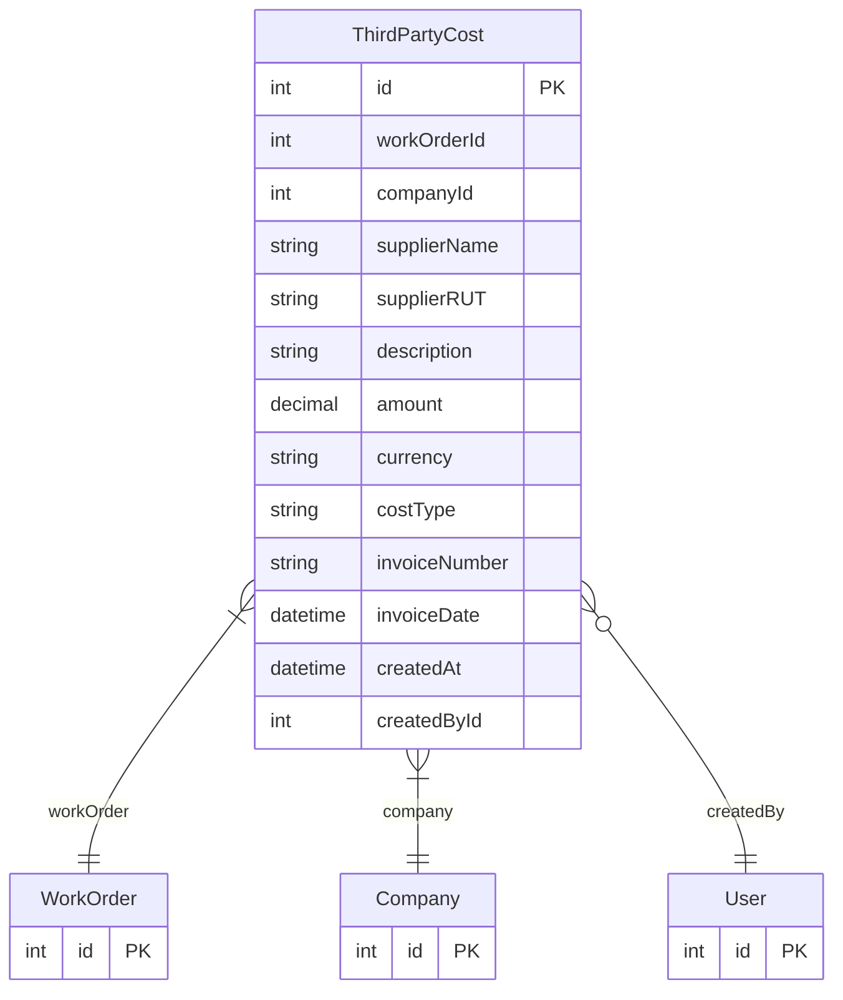

# ThirdPartyCost

> Table name: `third_party_costs`

**Schema location:** Lines 12411-12436

## Fields

| Field | Type | Required | Unique | Default | Notes |
|-------|------|----------|--------|---------|-------|
| `id` | `Int` | ✅ | 🔑 PK | `autoincrement(` |  |
| `workOrderId` | `Int` | ✅ |  | `` |  |
| `companyId` | `Int` | ✅ |  | `` |  |
| `supplierName` | `String` | ✅ |  | `` | Nombre del proveedor/tercero |
| `supplierRUT` | `String?` | ❌ |  | `` | CUIT/RUT del proveedor |
| `description` | `String?` | ❌ |  | `` | Descripción del servicio |
| `amount` | `Decimal` | ✅ |  | `` | DB: Decimal(12, 2) |
| `currency` | `String` | ✅ |  | `"ARS"` |  |
| `costType` | `String` | ✅ |  | `` | LABOR, PARTS, SERVICE, TRANSPORT, OTHER |
| `invoiceNumber` | `String?` | ❌ |  | `` | Número de factura |
| `invoiceDate` | `DateTime?` | ❌ |  | `` |  |
| `createdAt` | `DateTime` | ✅ |  | `now(` |  |
| `createdById` | `Int?` | ❌ |  | `` |  |

## Relations

| Field | Type | Cardinality | FK Fields | References | On Delete |
|-------|------|-------------|-----------|------------|-----------|
| `workOrder` | [WorkOrder](./models/WorkOrder.md) | Many-to-One | workOrderId | id | Cascade |
| `company` | [Company](./models/Company.md) | Many-to-One | companyId | id | Cascade |
| `createdBy` | [User](./models/User.md) | Many-to-One (optional) | createdById | id | - |

## Referenced By

| Model | Field | Cardinality |
|-------|-------|-------------|
| [Company](./models/Company.md) | `thirdPartyCosts` | Has many |
| [User](./models/User.md) | `thirdPartyCostsCreated` | Has many |
| [WorkOrder](./models/WorkOrder.md) | `thirdPartyCosts` | Has many |

## Indexes

- `workOrderId`
- `companyId`

## Entity Diagram

