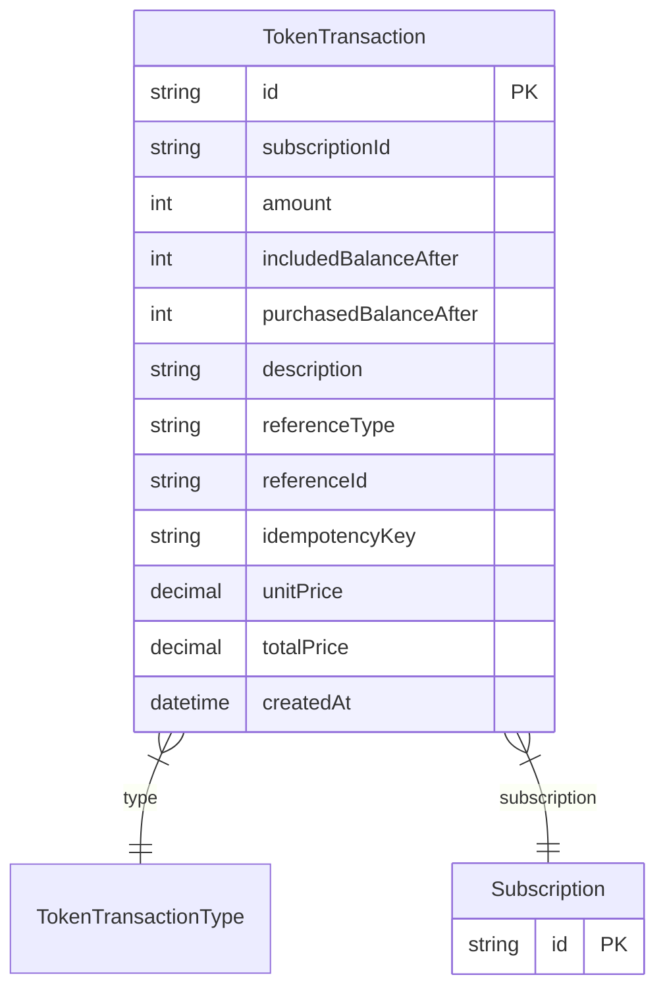

# TokenTransaction

> Table name: `token_transactions`

**Schema location:** Lines 11456-11488

## Fields

| Field | Type | Required | Unique | Default | Notes |
|-------|------|----------|--------|---------|-------|
| `id` | `String` | ✅ | 🔑 PK | `` |  |
| `subscriptionId` | `String` | ✅ |  | `` |  |
| `amount` | `Int` | ✅ |  | `` | Positivo=crédito, Negativo=débito |
| `includedBalanceAfter` | `Int` | ✅ |  | `` | Balance después de la transacción |
| `purchasedBalanceAfter` | `Int` | ✅ |  | `` |  |
| `description` | `String` | ✅ |  | `` |  |
| `referenceType` | `String?` | ❌ |  | `` | 'AI_QUERY', 'PDF_EXPORT', 'STORAGE', etc. |
| `referenceId` | `String?` | ❌ |  | `` |  |
| `idempotencyKey` | `String?` | ❌ |  | `` |  |
| `unitPrice` | `Decimal?` | ❌ |  | `` | DB: Decimal(12, 2). Precio si fue compra |
| `totalPrice` | `Decimal?` | ❌ |  | `` | DB: Decimal(12, 2) |
| `createdAt` | `DateTime` | ✅ |  | `now(` |  |

## Relations

| Field | Type | Cardinality | FK Fields | References | On Delete |
|-------|------|-------------|-----------|------------|-----------|
| `type` | [TokenTransactionType](./models/TokenTransactionType.md) | Many-to-One | - | - | - |
| `subscription` | [Subscription](./models/Subscription.md) | Many-to-One | subscriptionId | id | Cascade |

## Referenced By

| Model | Field | Cardinality |
|-------|-------|-------------|
| [Subscription](./models/Subscription.md) | `tokenTransactions` | Has many |

## Indexes

- `subscriptionId`
- `createdAt`
- `type`

## Unique Constraints

- `idempotencyKey`

## Entity Diagram

