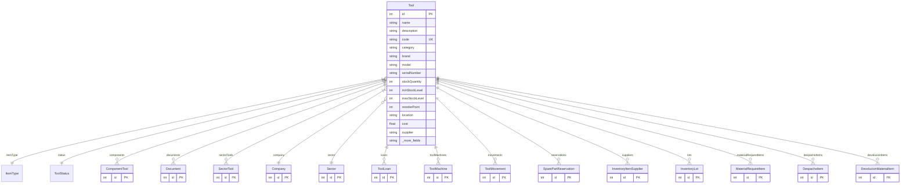

# Tool

> Table name: `Tool`

**Schema location:** Lines 1225-1289

## Fields

| Field | Type | Required | Unique | Default | Notes |
|-------|------|----------|--------|---------|-------|
| `id` | `Int` | ✅ | 🔑 PK | `autoincrement(` |  |
| `name` | `String` | ✅ |  | `` |  |
| `description` | `String?` | ❌ |  | `` |  |
| `code` | `String?` | ❌ | ✅ | `` |  |
| `category` | `String?` | ❌ |  | `` |  |
| `brand` | `String?` | ❌ |  | `` |  |
| `model` | `String?` | ❌ |  | `` |  |
| `serialNumber` | `String?` | ❌ |  | `` |  |
| `stockQuantity` | `Int` | ✅ |  | `0` |  |
| `minStockLevel` | `Int` | ✅ |  | `0` |  |
| `maxStockLevel` | `Int` | ✅ |  | `100` |  |
| `reorderPoint` | `Int?` | ❌ |  | `` | Punto de reorden automático |
| `location` | `String?` | ❌ |  | `` |  |
| `cost` | `Float?` | ❌ |  | `` |  |
| `supplier` | `String?` | ❌ |  | `` |  |
| `acquisitionDate` | `DateTime?` | ❌ |  | `` |  |
| `lastMaintenanceDate` | `DateTime?` | ❌ |  | `` |  |
| `nextMaintenanceDate` | `DateTime?` | ❌ |  | `` |  |
| `notes` | `String?` | ❌ |  | `` |  |
| `logo` | `String?` | ❌ |  | `` |  |
| `companyId` | `Int` | ✅ |  | `` |  |
| `sectorId` | `Int?` | ❌ |  | `` |  |
| `createdAt` | `DateTime` | ✅ |  | `now(` |  |
| `updatedAt` | `DateTime` | ✅ |  | `` |  |
| `isCritical` | `Boolean` | ✅ |  | `false` | Repuesto crítico |
| `leadTimeDays` | `Int?` | ❌ |  | `` | Días de entrega típico |
| `alternativeIds` | `Json?` | ❌ |  | `` | IDs de alternativos aprobados |
| `requiresCalibration` | `Boolean` | ✅ |  | `false` | === Campos específicos para HAND_TOOL === |
| `calibrationFrequencyDays` | `Int?` | ❌ |  | `` | Frecuencia de calibración en días |
| `calibrationStatus` | `String?` | ❌ |  | `` | OK, DUE, OVERDUE, BLOCKED |
| `lastCalibrationAt` | `DateTime?` | ❌ |  | `` |  |
| `nextCalibrationAt` | `DateTime?` | ❌ |  | `` |  |
| `unit` | `String?` | ❌ |  | `"unidad"` | Unidad de medida |
| `model3dUrl` | `String?` | ❌ |  | `` | URL del modelo 3D (GLB/GLTF) |

## Relations

| Field | Type | Cardinality | FK Fields | References | On Delete |
|-------|------|-------------|-----------|------------|-----------|
| `itemType` | [ItemType](./models/ItemType.md) | Many-to-One | - | - | - |
| `status` | [ToolStatus](./models/ToolStatus.md) | Many-to-One | - | - | - |
| `components` | [ComponentTool](./models/ComponentTool.md) | One-to-Many | - | - | - |
| `documents` | [Document](./models/Document.md) | One-to-Many | - | - | - |
| `sectorTools` | [SectorTool](./models/SectorTool.md) | One-to-Many | - | - | - |
| `company` | [Company](./models/Company.md) | Many-to-One | companyId | id | Cascade |
| `sector` | [Sector](./models/Sector.md) | Many-to-One (optional) | sectorId | id | - |
| `loans` | [ToolLoan](./models/ToolLoan.md) | One-to-Many | - | - | - |
| `toolMachines` | [ToolMachine](./models/ToolMachine.md) | One-to-Many | - | - | - |
| `movements` | [ToolMovement](./models/ToolMovement.md) | One-to-Many | - | - | - |
| `reservations` | [SparePartReservation](./models/SparePartReservation.md) | One-to-Many | - | - | - |
| `suppliers` | [InventoryItemSupplier](./models/InventoryItemSupplier.md) | One-to-Many | - | - | - |
| `lots` | [InventoryLot](./models/InventoryLot.md) | One-to-Many | - | - | - |
| `materialRequestItems` | [MaterialRequestItem](./models/MaterialRequestItem.md) | One-to-Many | - | - | - |
| `despachoItems` | [DespachoItem](./models/DespachoItem.md) | One-to-Many | - | - | - |
| `devolucionItems` | [DevolucionMaterialItem](./models/DevolucionMaterialItem.md) | One-to-Many | - | - | - |

## Referenced By

| Model | Field | Cardinality |
|-------|-------|-------------|
| [Company](./models/Company.md) | `tools` | Has many |
| [Sector](./models/Sector.md) | `tools` | Has many |
| [ToolMovement](./models/ToolMovement.md) | `tool` | Has one |
| [ToolLoan](./models/ToolLoan.md) | `tool` | Has one |
| [SparePartReservation](./models/SparePartReservation.md) | `tool` | Has one |
| [ToolMachine](./models/ToolMachine.md) | `tool` | Has one |
| [ComponentTool](./models/ComponentTool.md) | `tool` | Has one |
| [SectorTool](./models/SectorTool.md) | `tool` | Has one |
| [InventoryItemSupplier](./models/InventoryItemSupplier.md) | `tool` | Has one |
| [InventoryLot](./models/InventoryLot.md) | `tool` | Has one |
| [Document](./models/Document.md) | `tool` | Has one |
| [MaterialRequestItem](./models/MaterialRequestItem.md) | `tool` | Has one |
| [DespachoItem](./models/DespachoItem.md) | `tool` | Has one |
| [DevolucionMaterialItem](./models/DevolucionMaterialItem.md) | `tool` | Has one |

## Entity Diagram

