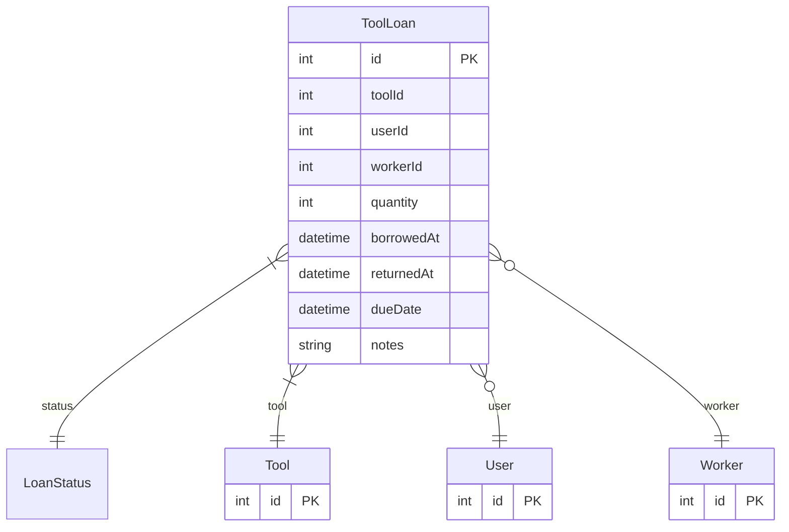

# ToolLoan

> Table name: `ToolLoan`

**Schema location:** Lines 1305-1321

## Fields

| Field | Type | Required | Unique | Default | Notes |
|-------|------|----------|--------|---------|-------|
| `id` | `Int` | ✅ | 🔑 PK | `autoincrement(` |  |
| `toolId` | `Int` | ✅ |  | `` |  |
| `userId` | `Int?` | ❌ |  | `` |  |
| `workerId` | `Int?` | ❌ |  | `` |  |
| `quantity` | `Int` | ✅ |  | `` |  |
| `borrowedAt` | `DateTime` | ✅ |  | `now(` |  |
| `returnedAt` | `DateTime?` | ❌ |  | `` |  |
| `dueDate` | `DateTime?` | ❌ |  | `` |  |
| `notes` | `String?` | ❌ |  | `` |  |

## Relations

| Field | Type | Cardinality | FK Fields | References | On Delete |
|-------|------|-------------|-----------|------------|-----------|
| `status` | [LoanStatus](./models/LoanStatus.md) | Many-to-One | - | - | - |
| `tool` | [Tool](./models/Tool.md) | Many-to-One | toolId | id | Cascade |
| `user` | [User](./models/User.md) | Many-to-One (optional) | userId | id | - |
| `worker` | [Worker](./models/Worker.md) | Many-to-One (optional) | workerId | id | - |

## Referenced By

| Model | Field | Cardinality |
|-------|-------|-------------|
| [User](./models/User.md) | `toolLoans` | Has many |
| [Tool](./models/Tool.md) | `loans` | Has many |
| [Worker](./models/Worker.md) | `toolLoans` | Has many |

## Entity Diagram

