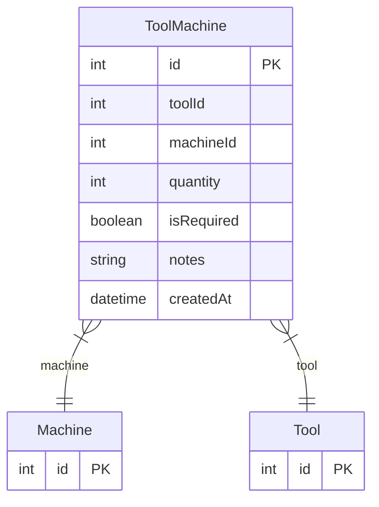

# ToolMachine

> Table name: `ToolMachine`

**Schema location:** Lines 1350-1363

## Fields

| Field | Type | Required | Unique | Default | Notes |
|-------|------|----------|--------|---------|-------|
| `id` | `Int` | ✅ | 🔑 PK | `autoincrement(` |  |
| `toolId` | `Int` | ✅ |  | `` |  |
| `machineId` | `Int` | ✅ |  | `` |  |
| `quantity` | `Int` | ✅ |  | `1` |  |
| `isRequired` | `Boolean` | ✅ |  | `false` |  |
| `notes` | `String?` | ❌ |  | `` |  |
| `createdAt` | `DateTime` | ✅ |  | `now(` |  |

## Relations

| Field | Type | Cardinality | FK Fields | References | On Delete |
|-------|------|-------------|-----------|------------|-----------|
| `machine` | [Machine](./models/Machine.md) | Many-to-One | machineId | id | Cascade |
| `tool` | [Tool](./models/Tool.md) | Many-to-One | toolId | id | Cascade |

## Referenced By

| Model | Field | Cardinality |
|-------|-------|-------------|
| [Machine](./models/Machine.md) | `toolMachines` | Has many |
| [Tool](./models/Tool.md) | `toolMachines` | Has many |

## Unique Constraints

- `toolId, machineId`

## Entity Diagram

