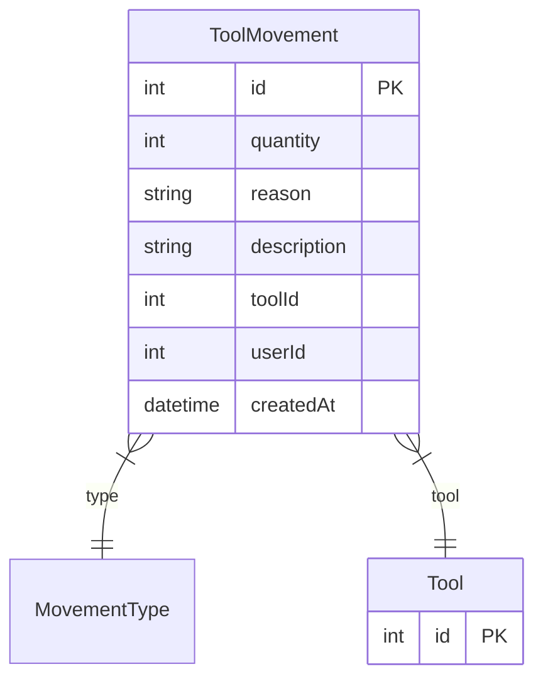

# ToolMovement

> Table name: `ToolMovement`

**Schema location:** Lines 1291-1303

## Fields

| Field | Type | Required | Unique | Default | Notes |
|-------|------|----------|--------|---------|-------|
| `id` | `Int` | ✅ | 🔑 PK | `autoincrement(` |  |
| `quantity` | `Int` | ✅ |  | `` |  |
| `reason` | `String?` | ❌ |  | `` |  |
| `description` | `String?` | ❌ |  | `` |  |
| `toolId` | `Int` | ✅ |  | `` |  |
| `userId` | `Int?` | ❌ |  | `` |  |
| `createdAt` | `DateTime` | ✅ |  | `now(` |  |

## Relations

| Field | Type | Cardinality | FK Fields | References | On Delete |
|-------|------|-------------|-----------|------------|-----------|
| `type` | [MovementType](./models/MovementType.md) | Many-to-One | - | - | - |
| `tool` | [Tool](./models/Tool.md) | Many-to-One | toolId | id | Cascade |

## Referenced By

| Model | Field | Cardinality |
|-------|-------|-------------|
| [Tool](./models/Tool.md) | `movements` | Has many |

## Entity Diagram

