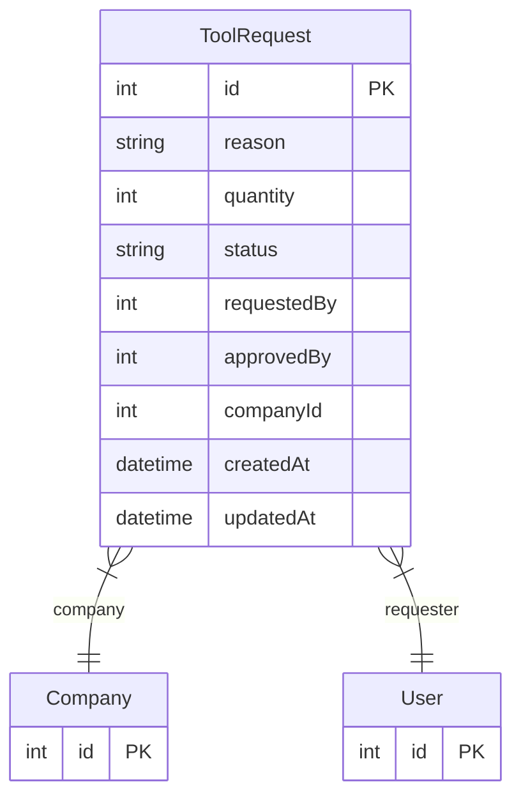

# ToolRequest

> Table name: `ToolRequest`

**Schema location:** Lines 2136-2150

## Fields

| Field | Type | Required | Unique | Default | Notes |
|-------|------|----------|--------|---------|-------|
| `id` | `Int` | ✅ | 🔑 PK | `autoincrement(` |  |
| `reason` | `String` | ✅ |  | `` |  |
| `quantity` | `Int` | ✅ |  | `1` |  |
| `status` | `String` | ✅ |  | `"PENDING"` |  |
| `requestedBy` | `Int` | ✅ |  | `` |  |
| `approvedBy` | `Int?` | ❌ |  | `` |  |
| `companyId` | `Int` | ✅ |  | `` |  |
| `createdAt` | `DateTime` | ✅ |  | `now(` |  |
| `updatedAt` | `DateTime` | ✅ |  | `` |  |

## Relations

| Field | Type | Cardinality | FK Fields | References | On Delete |
|-------|------|-------------|-----------|------------|-----------|
| `company` | [Company](./models/Company.md) | Many-to-One | companyId | id | Cascade |
| `requester` | [User](./models/User.md) | Many-to-One | requestedBy | id | - |

## Referenced By

| Model | Field | Cardinality |
|-------|-------|-------------|
| [Company](./models/Company.md) | `toolRequests` | Has many |
| [User](./models/User.md) | `toolRequests` | Has many |

## Entity Diagram

