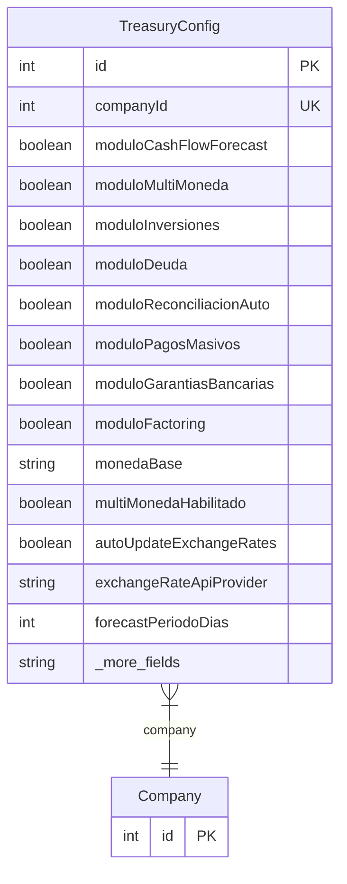

# TreasuryConfig

> Table name: `treasury_config`

**Schema location:** Lines 15240-15281

## Fields

| Field | Type | Required | Unique | Default | Notes |
|-------|------|----------|--------|---------|-------|
| `id` | `Int` | ✅ | 🔑 PK | `autoincrement(` |  |
| `companyId` | `Int` | ✅ | ✅ | `` |  |
| `moduloCashFlowForecast` | `Boolean` | ✅ |  | `false` | Módulos habilitados |
| `moduloMultiMoneda` | `Boolean` | ✅ |  | `false` |  |
| `moduloInversiones` | `Boolean` | ✅ |  | `false` |  |
| `moduloDeuda` | `Boolean` | ✅ |  | `false` |  |
| `moduloReconciliacionAuto` | `Boolean` | ✅ |  | `false` |  |
| `moduloPagosMasivos` | `Boolean` | ✅ |  | `false` |  |
| `moduloGarantiasBancarias` | `Boolean` | ✅ |  | `false` |  |
| `moduloFactoring` | `Boolean` | ✅ |  | `false` |  |
| `monedaBase` | `String` | ✅ |  | `"ARS"` | DB: VarChar(10). Configuración Multi-moneda |
| `multiMonedaHabilitado` | `Boolean` | ✅ |  | `false` |  |
| `autoUpdateExchangeRates` | `Boolean` | ✅ |  | `false` |  |
| `exchangeRateApiProvider` | `String?` | ❌ |  | `` | DB: VarChar(50) |
| `forecastPeriodoDias` | `Int` | ✅ |  | `90` | Configuración Cash Flow Forecast |
| `forecastIncluirVentasProyectadas` | `Boolean` | ✅ |  | `true` |  |
| `forecastIncluirComprasProyectadas` | `Boolean` | ✅ |  | `true` |  |
| `reconciliacionAutoHabilitada` | `Boolean` | ✅ |  | `false` | Configuración Reconciliación Automática |
| `reconciliacionMatchingThreshold` | `Decimal` | ✅ |  | `0.99` | DB: Decimal(5, 2) |
| `reconciliacionMlEnabled` | `Boolean` | ✅ |  | `false` |  |
| `reconciliationPatterns` | `Json?` | ❌ |  | `` | ML learned patterns for matching |
| `pagosMasivosFormato` | `String` | ✅ |  | `"AFIP"` | DB: VarChar(50). Configuración Pagos Masivos |
| `pagosMasivosRequiereAprobacion` | `Boolean` | ✅ |  | `true` |  |
| `createdAt` | `DateTime` | ✅ |  | `now(` |  |
| `updatedAt` | `DateTime` | ✅ |  | `` |  |

## Relations

| Field | Type | Cardinality | FK Fields | References | On Delete |
|-------|------|-------------|-----------|------------|-----------|
| `company` | [Company](./models/Company.md) | Many-to-One | companyId | id | Cascade |

## Referenced By

| Model | Field | Cardinality |
|-------|-------|-------------|
| [Company](./models/Company.md) | `treasuryConfig` | Has one |

## Entity Diagram

