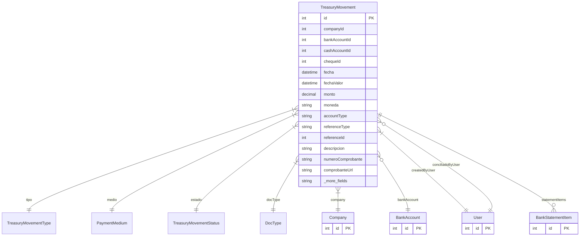

# TreasuryMovement

> Table name: `treasury_movements`

**Schema location:** Lines 11093-11144

## Fields

| Field | Type | Required | Unique | Default | Notes |
|-------|------|----------|--------|---------|-------|
| `id` | `Int` | ✅ | 🔑 PK | `autoincrement(` |  |
| `companyId` | `Int` | ✅ |  | `` |  |
| `bankAccountId` | `Int?` | ❌ |  | `` |  |
| `cashAccountId` | `Int?` | ❌ |  | `` |  |
| `chequeId` | `Int?` | ❌ |  | `` |  |
| `fecha` | `DateTime` | ✅ |  | `` | DB: Date. Datos del movimiento |
| `fechaValor` | `DateTime?` | ❌ |  | `` | DB: Date |
| `monto` | `Decimal` | ✅ |  | `` | DB: Decimal(15, 2) |
| `moneda` | `String` | ✅ |  | `"ARS"` | DB: VarChar(3) |
| `accountType` | `String` | ✅ |  | `` | DB: VarChar(20). CASH, BANK, CHECK_PORTFOLIO |
| `referenceType` | `String?` | ❌ |  | `` | DB: VarChar(50). Tipo: FACTURA, COBRO, PAGO, etc. |
| `referenceId` | `Int?` | ❌ |  | `` |  |
| `descripcion` | `String?` | ❌ |  | `` |  |
| `numeroComprobante` | `String?` | ❌ |  | `` | DB: VarChar(100) |
| `comprobanteUrl` | `String?` | ❌ |  | `` | DB: VarChar(500) |
| `conciliado` | `Boolean` | ✅ |  | `false` | Conciliación |
| `conciliadoAt` | `DateTime?` | ❌ |  | `` |  |
| `conciliadoBy` | `Int?` | ❌ |  | `` |  |
| `createdBy` | `Int` | ✅ |  | `` | Auditoría |
| `createdAt` | `DateTime` | ✅ |  | `now(` |  |
| `updatedAt` | `DateTime` | ✅ |  | `` |  |

## Relations

| Field | Type | Cardinality | FK Fields | References | On Delete |
|-------|------|-------------|-----------|------------|-----------|
| `tipo` | [TreasuryMovementType](./models/TreasuryMovementType.md) | Many-to-One | - | - | - |
| `medio` | [PaymentMedium](./models/PaymentMedium.md) | Many-to-One | - | - | - |
| `estado` | [TreasuryMovementStatus](./models/TreasuryMovementStatus.md) | Many-to-One | - | - | - |
| `docType` | [DocType](./models/DocType.md) | Many-to-One | - | - | - |
| `company` | [Company](./models/Company.md) | Many-to-One | companyId | id | Cascade |
| `bankAccount` | [BankAccount](./models/BankAccount.md) | Many-to-One (optional) | bankAccountId | id | - |
| `createdByUser` | [User](./models/User.md) | Many-to-One | createdBy | id | - |
| `conciliadoByUser` | [User](./models/User.md) | Many-to-One (optional) | conciliadoBy | id | - |
| `statementItems` | [BankStatementItem](./models/BankStatementItem.md) | One-to-Many | - | - | - |

## Referenced By

| Model | Field | Cardinality |
|-------|-------|-------------|
| [Company](./models/Company.md) | `treasuryMovements` | Has many |
| [User](./models/User.md) | `treasuryMovementsCreated` | Has many |
| [User](./models/User.md) | `treasuryMovementsConciliados` | Has many |
| [BankAccount](./models/BankAccount.md) | `treasuryMovements` | Has many |
| [BankStatementItem](./models/BankStatementItem.md) | `treasuryMovement` | Has one |

## Indexes

- `companyId`
- `bankAccountId`
- `fecha`
- `tipo`
- `conciliado`
- `docType`

## Entity Diagram

