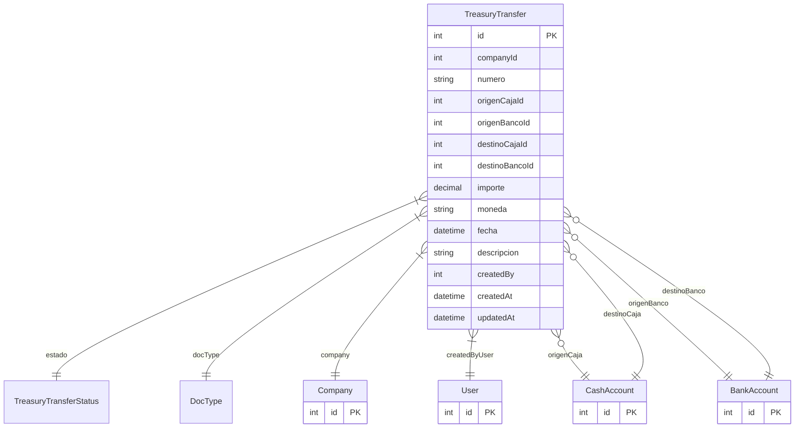

# TreasuryTransfer

> Table name: `treasury_transfers`

**Schema location:** Lines 10896-10942

## Fields

| Field | Type | Required | Unique | Default | Notes |
|-------|------|----------|--------|---------|-------|
| `id` | `Int` | ✅ | 🔑 PK | `autoincrement(` |  |
| `companyId` | `Int` | ✅ |  | `` |  |
| `numero` | `String` | ✅ |  | `` | DB: VarChar(50) |
| `origenCajaId` | `Int?` | ❌ |  | `` | Origen (uno de los dos) |
| `origenBancoId` | `Int?` | ❌ |  | `` |  |
| `destinoCajaId` | `Int?` | ❌ |  | `` | Destino (uno de los dos) |
| `destinoBancoId` | `Int?` | ❌ |  | `` |  |
| `importe` | `Decimal` | ✅ |  | `` | DB: Decimal(15, 2). Monto |
| `moneda` | `String` | ✅ |  | `"ARS"` | DB: VarChar(3) |
| `fecha` | `DateTime` | ✅ |  | `` | DB: Date. Fechas |
| `descripcion` | `String?` | ❌ |  | `` |  |
| `createdBy` | `Int` | ✅ |  | `` | Auditoría |
| `createdAt` | `DateTime` | ✅ |  | `now(` |  |
| `updatedAt` | `DateTime` | ✅ |  | `` |  |

## Relations

| Field | Type | Cardinality | FK Fields | References | On Delete |
|-------|------|-------------|-----------|------------|-----------|
| `estado` | [TreasuryTransferStatus](./models/TreasuryTransferStatus.md) | Many-to-One | - | - | - |
| `docType` | [DocType](./models/DocType.md) | Many-to-One | - | - | - |
| `company` | [Company](./models/Company.md) | Many-to-One | companyId | id | Cascade |
| `createdByUser` | [User](./models/User.md) | Many-to-One | createdBy | id | - |
| `origenCaja` | [CashAccount](./models/CashAccount.md) | Many-to-One (optional) | origenCajaId | id | - |
| `origenBanco` | [BankAccount](./models/BankAccount.md) | Many-to-One (optional) | origenBancoId | id | - |
| `destinoCaja` | [CashAccount](./models/CashAccount.md) | Many-to-One (optional) | destinoCajaId | id | - |
| `destinoBanco` | [BankAccount](./models/BankAccount.md) | Many-to-One (optional) | destinoBancoId | id | - |

## Referenced By

| Model | Field | Cardinality |
|-------|-------|-------------|
| [Company](./models/Company.md) | `treasuryTransfers` | Has many |
| [User](./models/User.md) | `treasuryTransfersCreated` | Has many |
| [CashAccount](./models/CashAccount.md) | `transfersOut` | Has many |
| [CashAccount](./models/CashAccount.md) | `transfersIn` | Has many |
| [BankAccount](./models/BankAccount.md) | `transfersOut` | Has many |
| [BankAccount](./models/BankAccount.md) | `transfersIn` | Has many |

## Indexes

- `companyId`
- `fecha`
- `estado`
- `docType`

## Unique Constraints

- `companyId, numero`

## Entity Diagram

