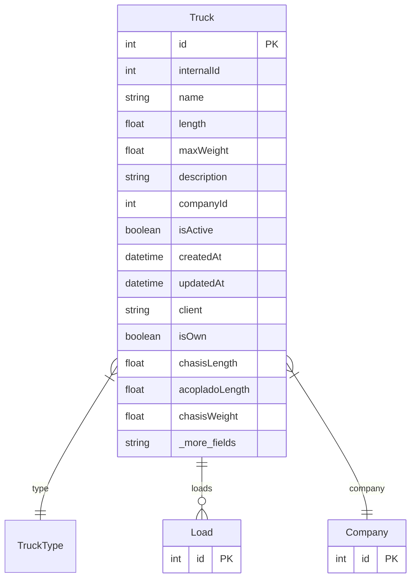

# Truck

> Table name: `Truck`

**Schema location:** Lines 4073-4100

## Fields

| Field | Type | Required | Unique | Default | Notes |
|-------|------|----------|--------|---------|-------|
| `id` | `Int` | ✅ | 🔑 PK | `autoincrement(` |  |
| `internalId` | `Int?` | ❌ |  | `` | ID interno único por empresa |
| `name` | `String` | ✅ |  | `` |  |
| `length` | `Float` | ✅ |  | `` |  |
| `maxWeight` | `Float?` | ❌ |  | `` |  |
| `description` | `String?` | ❌ |  | `` |  |
| `companyId` | `Int` | ✅ |  | `` |  |
| `isActive` | `Boolean` | ✅ |  | `true` |  |
| `createdAt` | `DateTime` | ✅ |  | `now(` |  |
| `updatedAt` | `DateTime` | ✅ |  | `` |  |
| `client` | `String?` | ❌ |  | `` |  |
| `isOwn` | `Boolean?` | ❌ |  | `true` |  |
| `chasisLength` | `Float?` | ❌ |  | `` |  |
| `acopladoLength` | `Float?` | ❌ |  | `` |  |
| `chasisWeight` | `Float?` | ❌ |  | `` |  |
| `acopladoWeight` | `Float?` | ❌ |  | `` |  |

## Relations

| Field | Type | Cardinality | FK Fields | References | On Delete |
|-------|------|-------------|-----------|------------|-----------|
| `type` | [TruckType](./models/TruckType.md) | Many-to-One | - | - | - |
| `loads` | [Load](./models/Load.md) | One-to-Many | - | - | - |
| `company` | [Company](./models/Company.md) | Many-to-One | companyId | id | Cascade |

## Referenced By

| Model | Field | Cardinality |
|-------|-------|-------------|
| [Company](./models/Company.md) | `trucks` | Has many |
| [Load](./models/Load.md) | `truck` | Has one |

## Indexes

- `companyId`
- `type`
- `internalId`

## Unique Constraints

- `companyId, name`
- `companyId, internalId`

## Entity Diagram

