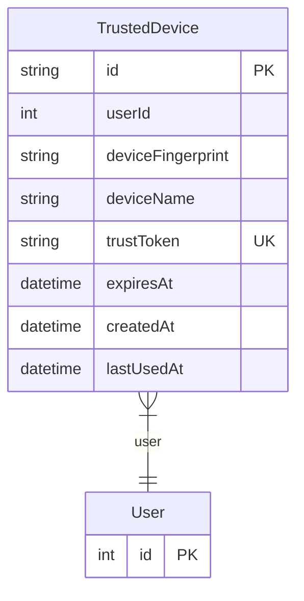

# TrustedDevice

> Table name: `trusted_devices`

**Schema location:** Lines 8139-8154

## Fields

| Field | Type | Required | Unique | Default | Notes |
|-------|------|----------|--------|---------|-------|
| `id` | `String` | ✅ | 🔑 PK | `uuid(` |  |
| `userId` | `Int` | ✅ |  | `` |  |
| `deviceFingerprint` | `String` | ✅ |  | `` |  |
| `deviceName` | `String?` | ❌ |  | `` |  |
| `trustToken` | `String` | ✅ | ✅ | `` |  |
| `expiresAt` | `DateTime` | ✅ |  | `` | 30 días típicamente |
| `createdAt` | `DateTime` | ✅ |  | `now(` |  |
| `lastUsedAt` | `DateTime` | ✅ |  | `now(` |  |

## Relations

| Field | Type | Cardinality | FK Fields | References | On Delete |
|-------|------|-------------|-----------|------------|-----------|
| `user` | [User](./models/User.md) | Many-to-One | userId | id | Cascade |

## Referenced By

| Model | Field | Cardinality |
|-------|-------|-------------|
| [User](./models/User.md) | `trustedDevices` | Has many |

## Indexes

- `userId`
- `trustToken`
- `deviceFingerprint`

## Entity Diagram

