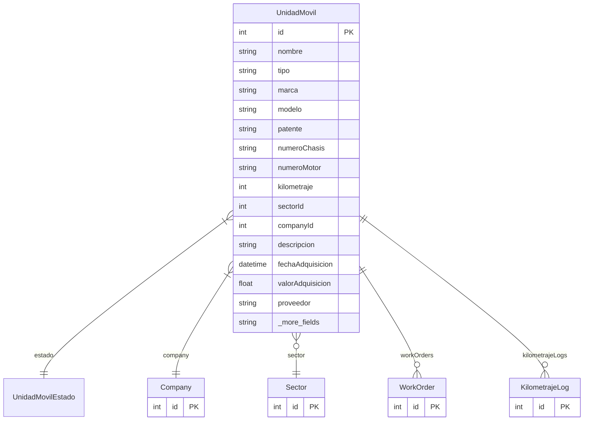

# UnidadMovil

> Table name: `UnidadMovil`

**Schema location:** Lines 863-901

## Fields

| Field | Type | Required | Unique | Default | Notes |
|-------|------|----------|--------|---------|-------|
| `id` | `Int` | ✅ | 🔑 PK | `autoincrement(` |  |
| `nombre` | `String` | ✅ |  | `` |  |
| `tipo` | `String` | ✅ |  | `` |  |
| `marca` | `String` | ✅ |  | `` |  |
| `modelo` | `String` | ✅ |  | `` |  |
| `patente` | `String` | ✅ |  | `` |  |
| `numeroChasis` | `String?` | ❌ |  | `` |  |
| `numeroMotor` | `String?` | ❌ |  | `` |  |
| `kilometraje` | `Int` | ✅ |  | `0` |  |
| `sectorId` | `Int?` | ❌ |  | `` |  |
| `companyId` | `Int` | ✅ |  | `` |  |
| `descripcion` | `String?` | ❌ |  | `` |  |
| `fechaAdquisicion` | `DateTime?` | ❌ |  | `` |  |
| `valorAdquisicion` | `Float?` | ❌ |  | `` |  |
| `proveedor` | `String?` | ❌ |  | `` |  |
| `garantiaHasta` | `DateTime?` | ❌ |  | `` |  |
| `ultimoMantenimiento` | `DateTime?` | ❌ |  | `` |  |
| `proximoMantenimiento` | `DateTime?` | ❌ |  | `` |  |
| `combustible` | `String?` | ❌ |  | `` |  |
| `capacidadCombustible` | `Int?` | ❌ |  | `` |  |
| `consumoPromedio` | `Float?` | ❌ |  | `` |  |
| `createdAt` | `DateTime` | ✅ |  | `now(` |  |
| `updatedAt` | `DateTime` | ✅ |  | `` |  |

## Relations

| Field | Type | Cardinality | FK Fields | References | On Delete |
|-------|------|-------------|-----------|------------|-----------|
| `estado` | [UnidadMovilEstado](./models/UnidadMovilEstado.md) | Many-to-One | - | - | - |
| `company` | [Company](./models/Company.md) | Many-to-One | companyId | id | Cascade |
| `sector` | [Sector](./models/Sector.md) | Many-to-One (optional) | sectorId | id | Cascade |
| `workOrders` | [WorkOrder](./models/WorkOrder.md) | One-to-Many | - | - | - |
| `kilometrajeLogs` | [KilometrajeLog](./models/KilometrajeLog.md) | One-to-Many | - | - | - |

## Referenced By

| Model | Field | Cardinality |
|-------|-------|-------------|
| [Company](./models/Company.md) | `unidadesMoviles` | Has many |
| [Sector](./models/Sector.md) | `unidadesMoviles` | Has many |
| [KilometrajeLog](./models/KilometrajeLog.md) | `unidadMovil` | Has one |
| [WorkOrder](./models/WorkOrder.md) | `unidadMovil` | Has one |

## Indexes

- `companyId`
- `companyId, estado`
- `companyId, sectorId`
- `companyId, tipo`
- `proximoMantenimiento`

## Unique Constraints

- `companyId, patente`

## Entity Diagram

