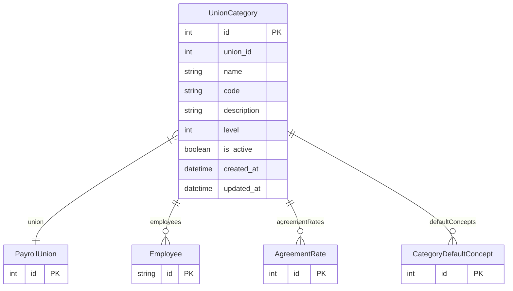

# UnionCategory

> Table name: `union_categories`

**Schema location:** Lines 12024-12044

## Fields

| Field | Type | Required | Unique | Default | Notes |
|-------|------|----------|--------|---------|-------|
| `id` | `Int` | ✅ | 🔑 PK | `autoincrement(` |  |
| `union_id` | `Int` | ✅ |  | `` |  |
| `name` | `String` | ✅ |  | `` | DB: VarChar(100). OFICIAL, MEDIO OFICIAL, AYUDANTE, SERENO |
| `code` | `String?` | ❌ |  | `` | DB: VarChar(20). Código corto |
| `description` | `String?` | ❌ |  | `` |  |
| `level` | `Int` | ✅ |  | `0` | Nivel jerárquico para ordenar |
| `is_active` | `Boolean` | ✅ |  | `true` |  |
| `created_at` | `DateTime` | ✅ |  | `now(` |  |
| `updated_at` | `DateTime` | ✅ |  | `` |  |

## Relations

| Field | Type | Cardinality | FK Fields | References | On Delete |
|-------|------|-------------|-----------|------------|-----------|
| `union` | [PayrollUnion](./models/PayrollUnion.md) | Many-to-One | union_id | id | Cascade |
| `employees` | [Employee](./models/Employee.md) | One-to-Many | - | - | - |
| `agreementRates` | [AgreementRate](./models/AgreementRate.md) | One-to-Many | - | - | - |
| `defaultConcepts` | [CategoryDefaultConcept](./models/CategoryDefaultConcept.md) | One-to-Many | - | - | - |

## Referenced By

| Model | Field | Cardinality |
|-------|-------|-------------|
| [Employee](./models/Employee.md) | `unionCategory` | Has one |
| [PayrollUnion](./models/PayrollUnion.md) | `categories` | Has many |
| [AgreementRate](./models/AgreementRate.md) | `unionCategory` | Has one |
| [CategoryDefaultConcept](./models/CategoryDefaultConcept.md) | `unionCategory` | Has one |

## Indexes

- `union_id`

## Unique Constraints

- `union_id, name`

## Entity Diagram

