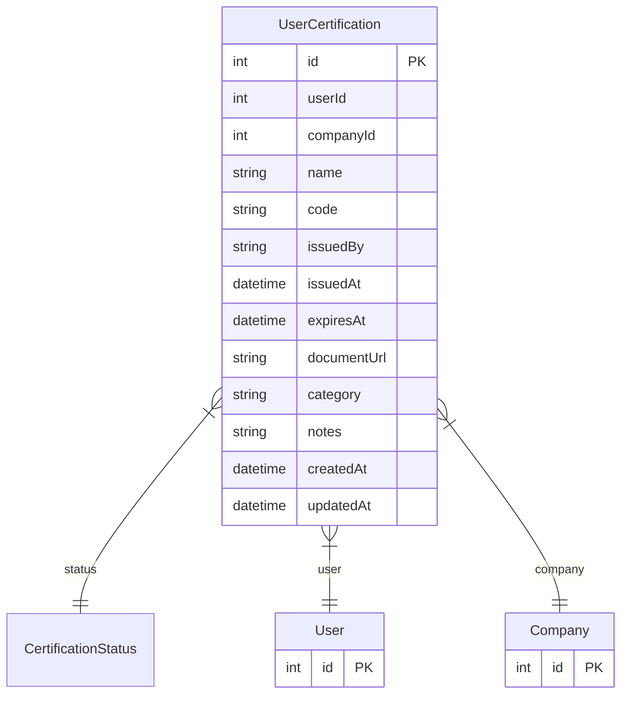

# UserCertification

> Table name: `user_certifications`

**Schema location:** Lines 13151-13176

## Fields

| Field | Type | Required | Unique | Default | Notes |
|-------|------|----------|--------|---------|-------|
| `id` | `Int` | ✅ | 🔑 PK | `autoincrement(` |  |
| `userId` | `Int` | ✅ |  | `` |  |
| `companyId` | `Int` | ✅ |  | `` |  |
| `name` | `String` | ✅ |  | `` | Nombre de la certificación (ej: "Operador de Autoelevadores") |
| `code` | `String?` | ❌ |  | `` | Código interno |
| `issuedBy` | `String` | ✅ |  | `` | Organismo emisor (ej: "IRAM", "Ministerio de Trabajo") |
| `issuedAt` | `DateTime` | ✅ |  | `` | Fecha de emisión |
| `expiresAt` | `DateTime?` | ❌ |  | `` | Fecha de vencimiento (null = no vence) |
| `documentUrl` | `String?` | ❌ |  | `` | URL al documento |
| `category` | `String?` | ❌ |  | `` | Categoría (Seguridad, Calidad, Operación, etc.) |
| `notes` | `String?` | ❌ |  | `` |  |
| `createdAt` | `DateTime` | ✅ |  | `now(` |  |
| `updatedAt` | `DateTime` | ✅ |  | `` |  |

## Relations

| Field | Type | Cardinality | FK Fields | References | On Delete |
|-------|------|-------------|-----------|------------|-----------|
| `status` | [CertificationStatus](./models/CertificationStatus.md) | Many-to-One | - | - | - |
| `user` | [User](./models/User.md) | Many-to-One | userId | id | Cascade |
| `company` | [Company](./models/Company.md) | Many-to-One | companyId | id | Cascade |

## Referenced By

| Model | Field | Cardinality |
|-------|-------|-------------|
| [Company](./models/Company.md) | `userCertifications` | Has many |
| [User](./models/User.md) | `certifications` | Has many |

## Indexes

- `userId`
- `companyId`
- `status`
- `expiresAt`

## Entity Diagram

