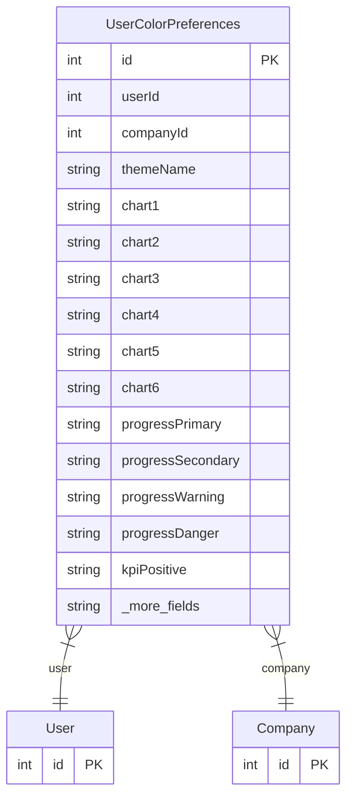

# UserColorPreferences

> Table name: `user_color_preferences`

**Schema location:** Lines 5413-5461

## Fields

| Field | Type | Required | Unique | Default | Notes |
|-------|------|----------|--------|---------|-------|
| `id` | `Int` | ✅ | 🔑 PK | `autoincrement(` |  |
| `userId` | `Int` | ✅ |  | `` |  |
| `companyId` | `Int` | ✅ |  | `` |  |
| `themeName` | `String` | ✅ |  | `"Personalizado"` | Nombre del tema (para identificación) |
| `chart1` | `String` | ✅ |  | `"#3b82f6"` | Colores de gráficos (series) |
| `chart2` | `String` | ✅ |  | `"#10b981"` |  |
| `chart3` | `String` | ✅ |  | `"#f59e0b"` |  |
| `chart4` | `String` | ✅ |  | `"#8b5cf6"` |  |
| `chart5` | `String` | ✅ |  | `"#06b6d4"` |  |
| `chart6` | `String` | ✅ |  | `"#ef4444"` |  |
| `progressPrimary` | `String` | ✅ |  | `"#3b82f6"` | Colores de barras de progreso |
| `progressSecondary` | `String` | ✅ |  | `"#10b981"` |  |
| `progressWarning` | `String` | ✅ |  | `"#f59e0b"` |  |
| `progressDanger` | `String` | ✅ |  | `"#ef4444"` |  |
| `kpiPositive` | `String` | ✅ |  | `"#10b981"` | Colores de KPIs |
| `kpiNegative` | `String` | ✅ |  | `"#ef4444"` |  |
| `kpiNeutral` | `String` | ✅ |  | `"#64748b"` |  |
| `cardHighlight` | `String` | ✅ |  | `"#ede9fe"` | Colores de fondos de cards |
| `cardMuted` | `String` | ✅ |  | `"#f1f5f9"` |  |
| `donut1` | `String` | ✅ |  | `"#3b82f6"` | Colores de donut/pie |
| `donut2` | `String` | ✅ |  | `"#10b981"` |  |
| `donut3` | `String` | ✅ |  | `"#f59e0b"` |  |
| `donut4` | `String` | ✅ |  | `"#8b5cf6"` |  |
| `donut5` | `String` | ✅ |  | `"#94a3b8"` |  |
| `createdAt` | `DateTime` | ✅ |  | `now(` |  |
| `updatedAt` | `DateTime` | ✅ |  | `` |  |

## Relations

| Field | Type | Cardinality | FK Fields | References | On Delete |
|-------|------|-------------|-----------|------------|-----------|
| `user` | [User](./models/User.md) | Many-to-One | userId | id | Cascade |
| `company` | [Company](./models/Company.md) | Many-to-One | companyId | id | Cascade |

## Referenced By

| Model | Field | Cardinality |
|-------|-------|-------------|
| [Company](./models/Company.md) | `userColorPreferences` | Has many |
| [User](./models/User.md) | `colorPreferences` | Has many |

## Indexes

- `userId`
- `companyId`

## Unique Constraints

- `userId, companyId`

## Entity Diagram

