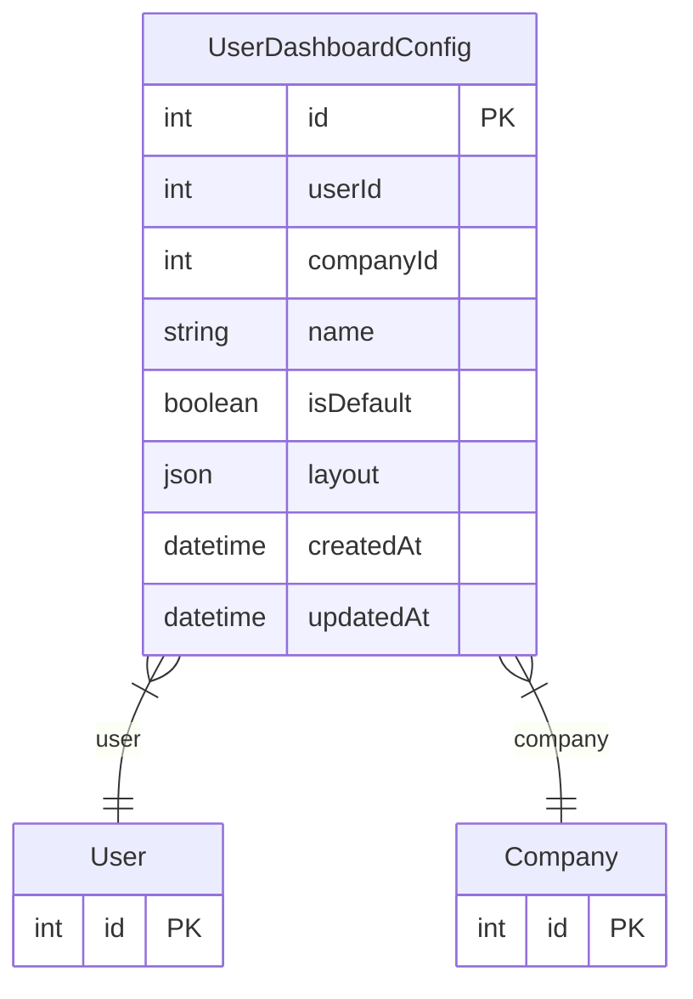

# UserDashboardConfig

> Table name: `user_dashboard_configs`

**Schema location:** Lines 5393-5410

## Fields

| Field | Type | Required | Unique | Default | Notes |
|-------|------|----------|--------|---------|-------|
| `id` | `Int` | ✅ | 🔑 PK | `autoincrement(` |  |
| `userId` | `Int` | ✅ |  | `` |  |
| `companyId` | `Int` | ✅ |  | `` |  |
| `name` | `String` | ✅ |  | `"Mi Dashboard"` |  |
| `isDefault` | `Boolean` | ✅ |  | `false` |  |
| `layout` | `Json` | ✅ |  | `` | Array de widgets con posición y tamaño |
| `createdAt` | `DateTime` | ✅ |  | `now(` |  |
| `updatedAt` | `DateTime` | ✅ |  | `` |  |

## Relations

| Field | Type | Cardinality | FK Fields | References | On Delete |
|-------|------|-------------|-----------|------------|-----------|
| `user` | [User](./models/User.md) | Many-to-One | userId | id | Cascade |
| `company` | [Company](./models/Company.md) | Many-to-One | companyId | id | Cascade |

## Referenced By

| Model | Field | Cardinality |
|-------|-------|-------------|
| [Company](./models/Company.md) | `userDashboardConfigs` | Has many |
| [User](./models/User.md) | `dashboardConfigs` | Has many |

## Indexes

- `userId`
- `companyId`

## Unique Constraints

- `userId, companyId, name`

## Entity Diagram

