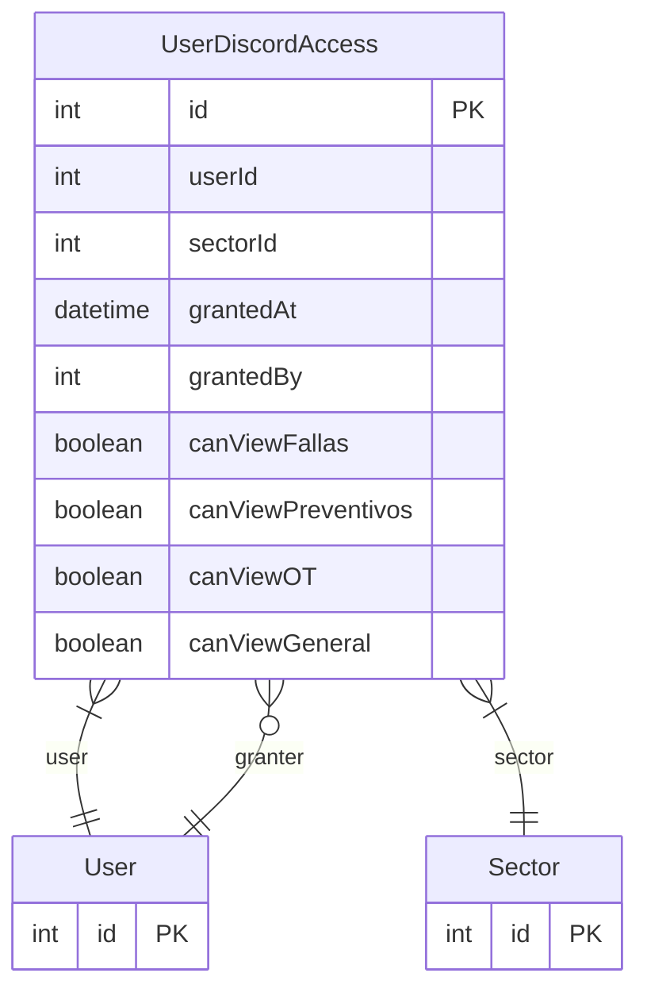

# UserDiscordAccess

> Table name: `UserDiscordAccess`

**Schema location:** Lines 731-751

## Fields

| Field | Type | Required | Unique | Default | Notes |
|-------|------|----------|--------|---------|-------|
| `id` | `Int` | ✅ | 🔑 PK | `autoincrement(` |  |
| `userId` | `Int` | ✅ |  | `` |  |
| `sectorId` | `Int` | ✅ |  | `` |  |
| `grantedAt` | `DateTime` | ✅ |  | `now(` |  |
| `grantedBy` | `Int?` | ❌ |  | `` | Usuario que otorgó el acceso |
| `canViewFallas` | `Boolean` | ✅ |  | `true` | Canal de Fallas |
| `canViewPreventivos` | `Boolean` | ✅ |  | `true` | Canal de Preventivos |
| `canViewOT` | `Boolean` | ✅ |  | `true` | Canal de Órdenes de Trabajo |
| `canViewGeneral` | `Boolean` | ✅ |  | `true` | Canal General |

## Relations

| Field | Type | Cardinality | FK Fields | References | On Delete |
|-------|------|-------------|-----------|------------|-----------|
| `user` | [User](./models/User.md) | Many-to-One | userId | id | Cascade |
| `sector` | [Sector](./models/Sector.md) | Many-to-One | sectorId | id | Cascade |
| `granter` | [User](./models/User.md) | Many-to-One (optional) | grantedBy | id | - |

## Referenced By

| Model | Field | Cardinality |
|-------|-------|-------------|
| [User](./models/User.md) | `discordSectorAccess` | Has many |
| [User](./models/User.md) | `discordAccessGranted` | Has many |
| [Sector](./models/Sector.md) | `userDiscordAccess` | Has many |

## Indexes

- `sectorId`

## Unique Constraints

- `userId, sectorId`

## Entity Diagram

