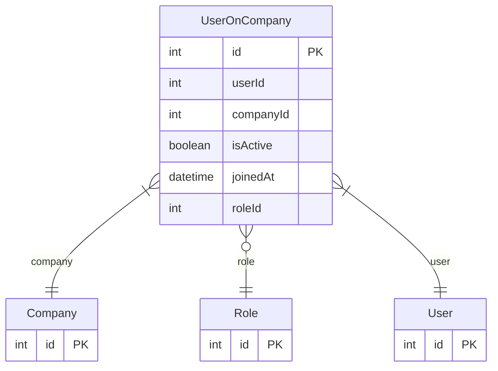

# UserOnCompany

> Table name: `UserOnCompany`

**Schema location:** Lines 711-727

## Fields

| Field | Type | Required | Unique | Default | Notes |
|-------|------|----------|--------|---------|-------|
| `id` | `Int` | ✅ | 🔑 PK | `autoincrement(` |  |
| `userId` | `Int` | ✅ |  | `` |  |
| `companyId` | `Int` | ✅ |  | `` |  |
| `isActive` | `Boolean` | ✅ |  | `true` |  |
| `joinedAt` | `DateTime` | ✅ |  | `now(` |  |
| `roleId` | `Int?` | ❌ |  | `` |  |

## Relations

| Field | Type | Cardinality | FK Fields | References | On Delete |
|-------|------|-------------|-----------|------------|-----------|
| `company` | [Company](./models/Company.md) | Many-to-One | companyId | id | Cascade |
| `role` | [Role](./models/Role.md) | Many-to-One (optional) | roleId | id | - |
| `user` | [User](./models/User.md) | Many-to-One | userId | id | Cascade |

## Referenced By

| Model | Field | Cardinality |
|-------|-------|-------------|
| [Company](./models/Company.md) | `users` | Has many |
| [User](./models/User.md) | `companies` | Has many |
| [Role](./models/Role.md) | `users` | Has many |

## Indexes

- `companyId, isActive`
- `companyId, roleId`
- `joinedAt`

## Unique Constraints

- `userId, companyId`

## Entity Diagram

