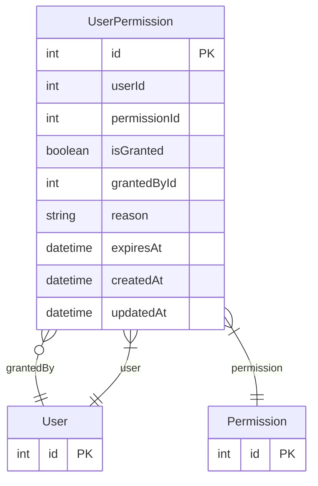

# UserPermission

> Table name: `UserPermission`

**Schema location:** Lines 2243-2259

## Fields

| Field | Type | Required | Unique | Default | Notes |
|-------|------|----------|--------|---------|-------|
| `id` | `Int` | ✅ | 🔑 PK | `autoincrement(` |  |
| `userId` | `Int` | ✅ |  | `` |  |
| `permissionId` | `Int` | ✅ |  | `` |  |
| `isGranted` | `Boolean` | ✅ |  | `` |  |
| `grantedById` | `Int?` | ❌ |  | `` |  |
| `reason` | `String?` | ❌ |  | `` |  |
| `expiresAt` | `DateTime?` | ❌ |  | `` |  |
| `createdAt` | `DateTime` | ✅ |  | `now(` |  |
| `updatedAt` | `DateTime` | ✅ |  | `` |  |

## Relations

| Field | Type | Cardinality | FK Fields | References | On Delete |
|-------|------|-------------|-----------|------------|-----------|
| `grantedBy` | [User](./models/User.md) | Many-to-One (optional) | grantedById | id | - |
| `permission` | [Permission](./models/Permission.md) | Many-to-One | permissionId | id | Cascade |
| `user` | [User](./models/User.md) | Many-to-One | userId | id | Cascade |

## Referenced By

| Model | Field | Cardinality |
|-------|-------|-------------|
| [User](./models/User.md) | `grantedPermissions` | Has many |
| [User](./models/User.md) | `userPermissions` | Has many |
| [Permission](./models/Permission.md) | `userPermissions` | Has many |

## Unique Constraints

- `userId, permissionId`

## Entity Diagram

