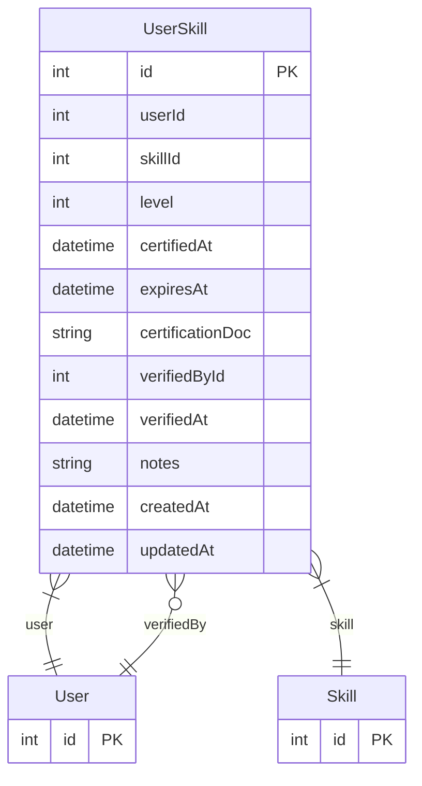

# UserSkill

> Table name: `user_skills`

**Schema location:** Lines 13125-13149

## Fields

| Field | Type | Required | Unique | Default | Notes |
|-------|------|----------|--------|---------|-------|
| `id` | `Int` | ✅ | 🔑 PK | `autoincrement(` |  |
| `userId` | `Int` | ✅ |  | `` |  |
| `skillId` | `Int` | ✅ |  | `` |  |
| `level` | `Int` | ✅ |  | `1` | 1-5 (1=Básico, 2=Intermedio, 3=Avanzado, 4=Experto, 5=Instructor) |
| `certifiedAt` | `DateTime?` | ❌ |  | `` | Fecha de certificación |
| `expiresAt` | `DateTime?` | ❌ |  | `` | Fecha de vencimiento (null = no vence) |
| `certificationDoc` | `String?` | ❌ |  | `` | URL al documento de certificación |
| `verifiedById` | `Int?` | ❌ |  | `` | Usuario que verificó/aprobó la habilidad |
| `verifiedAt` | `DateTime?` | ❌ |  | `` |  |
| `notes` | `String?` | ❌ |  | `` |  |
| `createdAt` | `DateTime` | ✅ |  | `now(` |  |
| `updatedAt` | `DateTime` | ✅ |  | `` |  |

## Relations

| Field | Type | Cardinality | FK Fields | References | On Delete |
|-------|------|-------------|-----------|------------|-----------|
| `user` | [User](./models/User.md) | Many-to-One | userId | id | Cascade |
| `skill` | [Skill](./models/Skill.md) | Many-to-One | skillId | id | Cascade |
| `verifiedBy` | [User](./models/User.md) | Many-to-One (optional) | verifiedById | id | - |

## Referenced By

| Model | Field | Cardinality |
|-------|-------|-------------|
| [User](./models/User.md) | `skills` | Has many |
| [User](./models/User.md) | `skillsVerified` | Has many |
| [Skill](./models/Skill.md) | `userSkills` | Has many |

## Indexes

- `userId`
- `skillId`
- `expiresAt`

## Unique Constraints

- `userId, skillId`

## Entity Diagram

