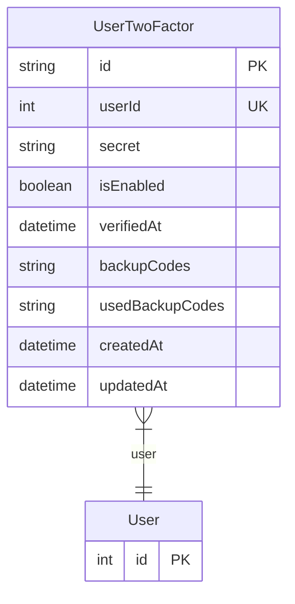

# UserTwoFactor

> Table name: `user_two_factor`

**Schema location:** Lines 8123-8136

## Fields

| Field | Type | Required | Unique | Default | Notes |
|-------|------|----------|--------|---------|-------|
| `id` | `String` | ✅ | 🔑 PK | `uuid(` |  |
| `userId` | `Int` | ✅ | ✅ | `` |  |
| `secret` | `String` | ✅ |  | `` | Encriptado con clave del servidor |
| `isEnabled` | `Boolean` | ✅ |  | `false` |  |
| `verifiedAt` | `DateTime?` | ❌ |  | `` |  |
| `backupCodes` | `String[]` | ✅ |  | `` | Hashes de códigos de respaldo |
| `usedBackupCodes` | `String[]` | ✅ |  | `` | Códigos ya usados |
| `createdAt` | `DateTime` | ✅ |  | `now(` |  |
| `updatedAt` | `DateTime` | ✅ |  | `` |  |

## Relations

| Field | Type | Cardinality | FK Fields | References | On Delete |
|-------|------|-------------|-----------|------------|-----------|
| `user` | [User](./models/User.md) | Many-to-One | userId | id | Cascade |

## Referenced By

| Model | Field | Cardinality |
|-------|-------|-------------|
| [User](./models/User.md) | `twoFactor` | Has one |

## Entity Diagram

