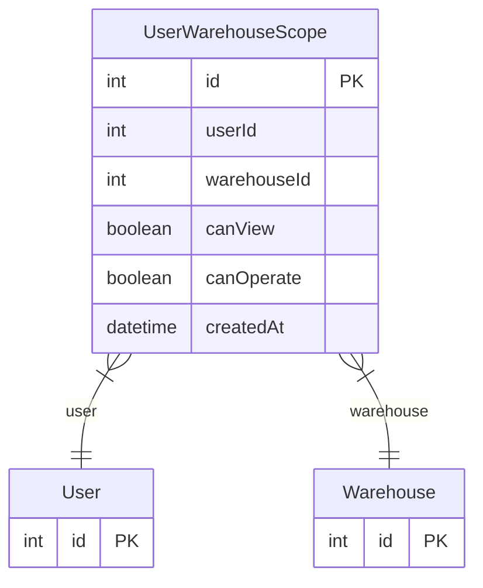

# UserWarehouseScope

> Table name: `user_warehouse_scopes`

**Schema location:** Lines 14881-14894

## Fields

| Field | Type | Required | Unique | Default | Notes |
|-------|------|----------|--------|---------|-------|
| `id` | `Int` | ✅ | 🔑 PK | `autoincrement(` |  |
| `userId` | `Int` | ✅ |  | `` |  |
| `warehouseId` | `Int` | ✅ |  | `` |  |
| `canView` | `Boolean` | ✅ |  | `true` |  |
| `canOperate` | `Boolean` | ✅ |  | `false` |  |
| `createdAt` | `DateTime` | ✅ |  | `now(` |  |

## Relations

| Field | Type | Cardinality | FK Fields | References | On Delete |
|-------|------|-------------|-----------|------------|-----------|
| `user` | [User](./models/User.md) | Many-to-One | userId | id | Cascade |
| `warehouse` | [Warehouse](./models/Warehouse.md) | Many-to-One | warehouseId | id | Cascade |

## Referenced By

| Model | Field | Cardinality |
|-------|-------|-------------|
| [User](./models/User.md) | `warehouseScopes` | Has many |
| [Warehouse](./models/Warehouse.md) | `userWarehouseScopes` | Has many |

## Unique Constraints

- `userId, warehouseId`

## Entity Diagram

