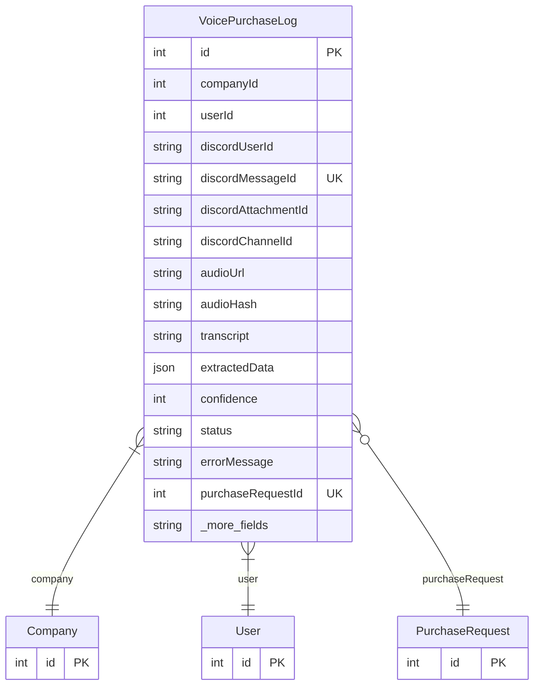

# VoicePurchaseLog

> Table name: `voice_purchase_logs`

**Schema location:** Lines 14208-14236

## Fields

| Field | Type | Required | Unique | Default | Notes |
|-------|------|----------|--------|---------|-------|
| `id` | `Int` | ✅ | 🔑 PK | `autoincrement(` |  |
| `companyId` | `Int` | ✅ |  | `` |  |
| `userId` | `Int` | ✅ |  | `` |  |
| `discordUserId` | `String` | ✅ |  | `` |  |
| `discordMessageId` | `String` | ✅ | ✅ | `` | Para idempotencia |
| `discordAttachmentId` | `String` | ✅ |  | `` |  |
| `discordChannelId` | `String?` | ❌ |  | `` |  |
| `audioUrl` | `String?` | ❌ |  | `` | URL o referencia S3 |
| `audioHash` | `String?` | ❌ |  | `` | Hash SHA256 para dedup adicional |
| `transcript` | `String?` | ❌ |  | `` | DB: Text |
| `extractedData` | `Json?` | ❌ |  | `` | JSON del GPT |
| `confidence` | `Int?` | ❌ |  | `` | 0-100 |
| `status` | `String` | ✅ |  | `"PENDING"` | PENDING, PROCESSING, COMPLETED, FAILED |
| `errorMessage` | `String?` | ❌ |  | `` |  |
| `purchaseRequestId` | `Int?` | ❌ | ✅ | `` | FK al pedido creado |
| `createdAt` | `DateTime` | ✅ |  | `now(` |  |
| `processedAt` | `DateTime?` | ❌ |  | `` |  |

## Relations

| Field | Type | Cardinality | FK Fields | References | On Delete |
|-------|------|-------------|-----------|------------|-----------|
| `company` | [Company](./models/Company.md) | Many-to-One | companyId | id | Cascade |
| `user` | [User](./models/User.md) | Many-to-One | userId | id | - |
| `purchaseRequest` | [PurchaseRequest](./models/PurchaseRequest.md) | Many-to-One (optional) | purchaseRequestId | id | - |

## Referenced By

| Model | Field | Cardinality |
|-------|-------|-------------|
| [Company](./models/Company.md) | `voicePurchaseLogs` | Has many |
| [User](./models/User.md) | `voicePurchaseLogs` | Has many |
| [PurchaseRequest](./models/PurchaseRequest.md) | `voicePurchaseLog` | Has one |

## Indexes

- `discordMessageId`
- `status`
- `companyId`
- `userId`

## Entity Diagram

