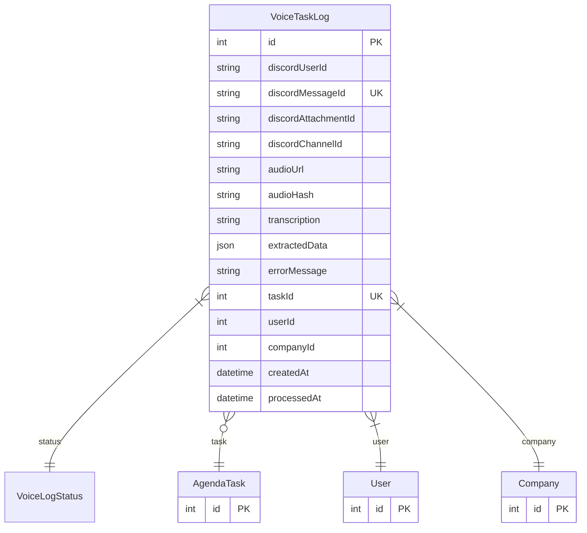

# VoiceTaskLog

> Table name: `voice_task_logs`

**Schema location:** Lines 14464-14501

## Fields

| Field | Type | Required | Unique | Default | Notes |
|-------|------|----------|--------|---------|-------|
| `id` | `Int` | ✅ | 🔑 PK | `autoincrement(` |  |
| `discordUserId` | `String` | ✅ |  | `` | Discord info |
| `discordMessageId` | `String` | ✅ | ✅ | `` |  |
| `discordAttachmentId` | `String?` | ❌ |  | `` |  |
| `discordChannelId` | `String?` | ❌ |  | `` |  |
| `audioUrl` | `String?` | ❌ |  | `` | Audio |
| `audioHash` | `String?` | ❌ |  | `` |  |
| `transcription` | `String?` | ❌ |  | `` |  |
| `extractedData` | `Json?` | ❌ |  | `` |  |
| `errorMessage` | `String?` | ❌ |  | `` |  |
| `taskId` | `Int?` | ❌ | ✅ | `` | Tarea creada (si fue exitoso) |
| `userId` | `Int` | ✅ |  | `` | Usuario y empresa |
| `companyId` | `Int` | ✅ |  | `` |  |
| `createdAt` | `DateTime` | ✅ |  | `now(` | Timestamps |
| `processedAt` | `DateTime?` | ❌ |  | `` |  |

## Relations

| Field | Type | Cardinality | FK Fields | References | On Delete |
|-------|------|-------------|-----------|------------|-----------|
| `status` | [VoiceLogStatus](./models/VoiceLogStatus.md) | Many-to-One | - | - | - |
| `task` | [AgendaTask](./models/AgendaTask.md) | Many-to-One (optional) | taskId | id | SetNull |
| `user` | [User](./models/User.md) | Many-to-One | userId | id | Cascade |
| `company` | [Company](./models/Company.md) | Many-to-One | companyId | id | Cascade |

## Referenced By

| Model | Field | Cardinality |
|-------|-------|-------------|
| [Company](./models/Company.md) | `voiceTaskLogs` | Has many |
| [User](./models/User.md) | `voiceTaskLogs` | Has many |
| [AgendaTask](./models/AgendaTask.md) | `voiceLog` | Has one |

## Indexes

- `discordUserId`
- `status`
- `companyId`

## Entity Diagram

