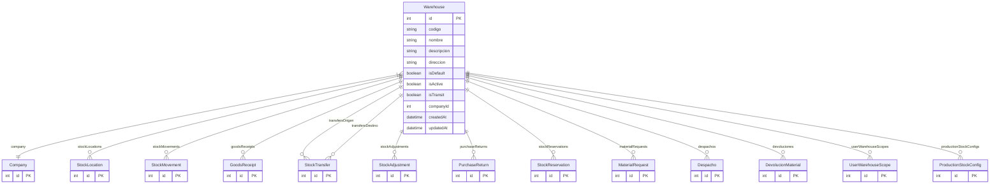

# Warehouse

> Table name: `warehouses`

**Schema location:** Lines 6109-6142

## Fields

| Field | Type | Required | Unique | Default | Notes |
|-------|------|----------|--------|---------|-------|
| `id` | `Int` | ✅ | 🔑 PK | `autoincrement(` |  |
| `codigo` | `String` | ✅ |  | `` | DB: VarChar(50) |
| `nombre` | `String` | ✅ |  | `` | DB: VarChar(255) |
| `descripcion` | `String?` | ❌ |  | `` |  |
| `direccion` | `String?` | ❌ |  | `` |  |
| `isDefault` | `Boolean` | ✅ |  | `false` |  |
| `isActive` | `Boolean` | ✅ |  | `true` |  |
| `isTransit` | `Boolean` | ✅ |  | `false` | Para warehouse virtual IN_TRANSIT |
| `companyId` | `Int` | ✅ |  | `` |  |
| `createdAt` | `DateTime` | ✅ |  | `now(` |  |
| `updatedAt` | `DateTime` | ✅ |  | `` |  |

## Relations

| Field | Type | Cardinality | FK Fields | References | On Delete |
|-------|------|-------------|-----------|------------|-----------|
| `company` | [Company](./models/Company.md) | Many-to-One | companyId | id | Cascade |
| `stockLocations` | [StockLocation](./models/StockLocation.md) | One-to-Many | - | - | - |
| `stockMovements` | [StockMovement](./models/StockMovement.md) | One-to-Many | - | - | - |
| `goodsReceipts` | [GoodsReceipt](./models/GoodsReceipt.md) | One-to-Many | - | - | - |
| `transfersOrigen` | [StockTransfer](./models/StockTransfer.md) | One-to-Many | - | - | - |
| `transfersDestino` | [StockTransfer](./models/StockTransfer.md) | One-to-Many | - | - | - |
| `stockAdjustments` | [StockAdjustment](./models/StockAdjustment.md) | One-to-Many | - | - | - |
| `purchaseReturns` | [PurchaseReturn](./models/PurchaseReturn.md) | One-to-Many | - | - | - |
| `stockReservations` | [StockReservation](./models/StockReservation.md) | One-to-Many | - | - | - |
| `materialRequests` | [MaterialRequest](./models/MaterialRequest.md) | One-to-Many | - | - | - |
| `despachos` | [Despacho](./models/Despacho.md) | One-to-Many | - | - | - |
| `devoluciones` | [DevolucionMaterial](./models/DevolucionMaterial.md) | One-to-Many | - | - | - |
| `userWarehouseScopes` | [UserWarehouseScope](./models/UserWarehouseScope.md) | One-to-Many | - | - | - |
| `productionStockConfigs` | [ProductionStockConfig](./models/ProductionStockConfig.md) | One-to-Many | - | - | - |

## Referenced By

| Model | Field | Cardinality |
|-------|-------|-------------|
| [Company](./models/Company.md) | `warehouses` | Has many |
| [StockLocation](./models/StockLocation.md) | `warehouse` | Has one |
| [StockMovement](./models/StockMovement.md) | `warehouse` | Has one |
| [StockTransfer](./models/StockTransfer.md) | `warehouseOrigen` | Has one |
| [StockTransfer](./models/StockTransfer.md) | `warehouseDestino` | Has one |
| [StockAdjustment](./models/StockAdjustment.md) | `warehouse` | Has one |
| [GoodsReceipt](./models/GoodsReceipt.md) | `warehouse` | Has one |
| [PurchaseReturn](./models/PurchaseReturn.md) | `warehouse` | Has one |
| [StockReservation](./models/StockReservation.md) | `warehouse` | Has one |
| [MaterialRequest](./models/MaterialRequest.md) | `warehouse` | Has one |
| [Despacho](./models/Despacho.md) | `warehouse` | Has one |
| [DevolucionMaterial](./models/DevolucionMaterial.md) | `warehouse` | Has one |
| [UserWarehouseScope](./models/UserWarehouseScope.md) | `warehouse` | Has one |
| [ProductionStockConfig](./models/ProductionStockConfig.md) | `defaultWarehouse` | Has one |

## Indexes

- `companyId`
- `isActive`

## Unique Constraints

- `companyId, codigo`

## Entity Diagram

