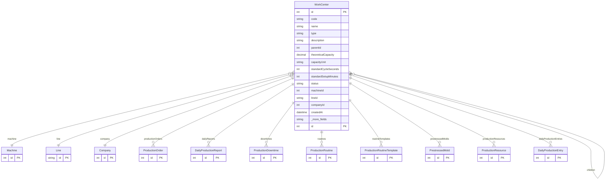

# WorkCenter

> Table name: `work_centers`

**Schema location:** Lines 13459-13505

## Fields

| Field | Type | Required | Unique | Default | Notes |
|-------|------|----------|--------|---------|-------|
| `id` | `Int` | ✅ | 🔑 PK | `autoincrement(` |  |
| `code` | `String` | ✅ |  | `` |  |
| `name` | `String` | ✅ |  | `` |  |
| `type` | `String` | ✅ |  | `` | 'LINE', 'MACHINE', 'STATION', 'CELL', 'MOLD', custom |
| `description` | `String?` | ❌ |  | `` |  |
| `parentId` | `Int?` | ❌ |  | `` | Jerarquía opcional |
| `theoreticalCapacity` | `Decimal?` | ❌ |  | `` | DB: Decimal(12, 4). Capacidad (opcional, para OEE PRO) |
| `capacityUnit` | `String?` | ❌ |  | `` | "unidades/hora", "m3/turno" |
| `standardCycleSeconds` | `Int?` | ❌ |  | `` |  |
| `standardSetupMinutes` | `Int?` | ❌ |  | `` |  |
| `status` | `String` | ✅ |  | `"ACTIVE"` | ACTIVE, MAINTENANCE, INACTIVE |
| `machineId` | `Int?` | ❌ |  | `` | Vincular con Machine existente (si aplica) |
| `lineId` | `String?` | ❌ |  | `` | Vincular con Line existente (si aplica) |
| `companyId` | `Int` | ✅ |  | `` |  |
| `createdAt` | `DateTime` | ✅ |  | `now(` |  |
| `updatedAt` | `DateTime` | ✅ |  | `` |  |

## Relations

| Field | Type | Cardinality | FK Fields | References | On Delete |
|-------|------|-------------|-----------|------------|-----------|
| `parent` | [WorkCenter](./models/WorkCenter.md) | Many-to-One (optional) | parentId | id | - |
| `children` | [WorkCenter](./models/WorkCenter.md) | One-to-Many | - | - | - |
| `machine` | [Machine](./models/Machine.md) | Many-to-One (optional) | machineId | id | - |
| `line` | [Line](./models/Line.md) | Many-to-One (optional) | lineId | id | - |
| `company` | [Company](./models/Company.md) | Many-to-One | companyId | id | Cascade |
| `productionOrders` | [ProductionOrder](./models/ProductionOrder.md) | One-to-Many | - | - | - |
| `dailyReports` | [DailyProductionReport](./models/DailyProductionReport.md) | One-to-Many | - | - | - |
| `downtimes` | [ProductionDowntime](./models/ProductionDowntime.md) | One-to-Many | - | - | - |
| `routines` | [ProductionRoutine](./models/ProductionRoutine.md) | One-to-Many | - | - | - |
| `routineTemplates` | [ProductionRoutineTemplate](./models/ProductionRoutineTemplate.md) | One-to-Many | - | - | - |
| `prestressedMolds` | [PrestressedMold](./models/PrestressedMold.md) | One-to-Many | - | - | - |
| `productionResources` | [ProductionResource](./models/ProductionResource.md) | One-to-Many | - | - | - |
| `dailyProductionEntries` | [DailyProductionEntry](./models/DailyProductionEntry.md) | One-to-Many | - | - | - |

## Referenced By

| Model | Field | Cardinality |
|-------|-------|-------------|
| [Company](./models/Company.md) | `workCenters` | Has many |
| [Machine](./models/Machine.md) | `workCenters` | Has many |
| [Line](./models/Line.md) | `workCenters` | Has many |
| [ProductionOrder](./models/ProductionOrder.md) | `workCenter` | Has one |
| [DailyProductionReport](./models/DailyProductionReport.md) | `workCenter` | Has one |
| [ProductionDowntime](./models/ProductionDowntime.md) | `workCenter` | Has one |
| [ProductionRoutineTemplate](./models/ProductionRoutineTemplate.md) | `workCenter` | Has one |
| [ProductionRoutine](./models/ProductionRoutine.md) | `workCenter` | Has one |
| [DailyProductionEntry](./models/DailyProductionEntry.md) | `workCenter` | Has one |
| [ProductionResource](./models/ProductionResource.md) | `workCenter` | Has one |
| [PrestressedMold](./models/PrestressedMold.md) | `workCenter` | Has one |

## Indexes

- `companyId, type, status`

## Unique Constraints

- `companyId, code`

## Entity Diagram

