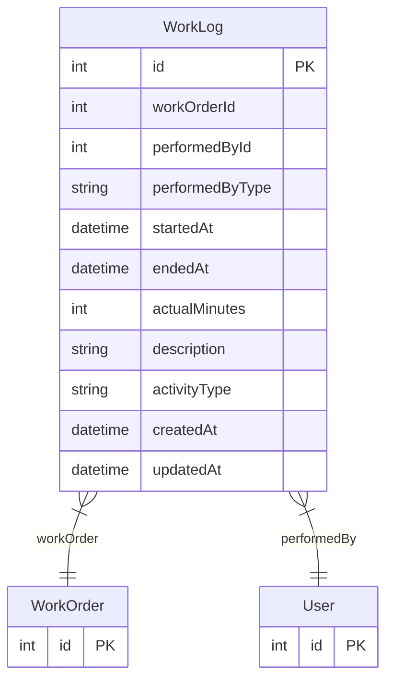

# WorkLog

> Table name: `work_logs`

**Schema location:** Lines 5585-5604

## Fields

| Field | Type | Required | Unique | Default | Notes |
|-------|------|----------|--------|---------|-------|
| `id` | `Int` | ✅ | 🔑 PK | `autoincrement(` |  |
| `workOrderId` | `Int` | ✅ |  | `` |  |
| `performedById` | `Int` | ✅ |  | `` |  |
| `performedByType` | `String` | ✅ |  | `"USER"` |  |
| `startedAt` | `DateTime` | ✅ |  | `` |  |
| `endedAt` | `DateTime?` | ❌ |  | `` |  |
| `actualMinutes` | `Int?` | ❌ |  | `` |  |
| `description` | `String?` | ❌ |  | `` |  |
| `activityType` | `String` | ✅ |  | `"EXECUTION"` | EXECUTION | DIAGNOSIS | WAITING | TRAVEL | DOCUMENTATION |
| `createdAt` | `DateTime` | ✅ |  | `now(` |  |
| `updatedAt` | `DateTime` | ✅ |  | `` |  |

## Relations

| Field | Type | Cardinality | FK Fields | References | On Delete |
|-------|------|-------------|-----------|------------|-----------|
| `workOrder` | [WorkOrder](./models/WorkOrder.md) | Many-to-One | workOrderId | id | Cascade |
| `performedBy` | [User](./models/User.md) | Many-to-One | performedById | id | - |

## Referenced By

| Model | Field | Cardinality |
|-------|-------|-------------|
| [User](./models/User.md) | `workLogsPerformed` | Has many |
| [WorkOrder](./models/WorkOrder.md) | `workLogs` | Has many |

## Indexes

- `workOrderId`
- `performedById, startedAt`

## Entity Diagram

