# WorkOrder

> Table name: `work_orders`

**Schema location:** Lines 1530-1688

## Fields

| Field | Type | Required | Unique | Default | Notes |
|-------|------|----------|--------|---------|-------|
| `id` | `Int` | ✅ | 🔑 PK | `autoincrement(` |  |
| `title` | `String` | ✅ |  | `` |  |
| `description` | `String?` | ❌ |  | `` |  |
| `machineId` | `Int?` | ❌ |  | `` |  |
| `componentId` | `Int?` | ❌ |  | `` |  |
| `workStationId` | `Int?` | ❌ |  | `` |  |
| `assignedToId` | `Int?` | ❌ |  | `` |  |
| `assignedWorkerId` | `Int?` | ❌ |  | `` |  |
| `createdById` | `Int` | ✅ |  | `` |  |
| `scheduledDate` | `DateTime?` | ❌ |  | `` |  |
| `startedDate` | `DateTime?` | ❌ |  | `` |  |
| `completedDate` | `DateTime?` | ❌ |  | `` |  |
| `estimatedHours` | `Float?` | ❌ |  | `` |  |
| `actualHours` | `Float?` | ❌ |  | `` |  |
| `cost` | `Float?` | ❌ |  | `` |  |
| `notes` | `String?` | ❌ |  | `` |  |
| `companyId` | `Int` | ✅ |  | `` |  |
| `sectorId` | `Int?` | ❌ |  | `` |  |
| `createdAt` | `DateTime` | ✅ |  | `now(` |  |
| `updatedAt` | `DateTime` | ✅ |  | `` |  |
| `rootCause` | `String?` | ❌ |  | `` |  |
| `correctiveActions` | `String?` | ❌ |  | `` |  |
| `preventiveActions` | `String?` | ❌ |  | `` |  |
| `spareParts` | `Json?` | ❌ |  | `` |  |
| `failureDescription` | `String?` | ❌ |  | `` |  |
| `solution` | `String?` | ❌ |  | `` |  |
| `timeValue` | `Float?` | ❌ |  | `` |  |
| `tags` | `String[]` | ✅ |  | `[]` |  |
| `isCompleted` | `Boolean` | ✅ |  | `false` |  |
| `completionRate` | `Float?` | ❌ |  | `` |  |
| `unidadMovilId` | `Int?` | ❌ |  | `` |  |
| `waitingReason` | `String?` | ❌ |  | `` | SPARE_PART | VENDOR | PRODUCTION | OTHER |
| `waitingDescription` | `String?` | ❌ |  | `` |  |
| `waitingETA` | `DateTime?` | ❌ |  | `` |  |
| `waitingSince` | `DateTime?` | ❌ |  | `` |  |
| `closingMode` | `String?` | ❌ |  | `` | MINIMUM | PROFESSIONAL |
| `diagnosisNotes` | `String?` | ❌ |  | `` |  |
| `workPerformedNotes` | `String?` | ❌ |  | `` | Rich text |
| `resultNotes` | `String?` | ❌ |  | `` |  |
| `isSafetyRelated` | `Boolean` | ✅ |  | `false` | Seguridad |
| `requiresReturnToProduction` | `Boolean` | ✅ |  | `false` | Cierre requiere retorno a producción |
| `returnToProductionConfirmed` | `Boolean` | ✅ |  | `false` |  |
| `fromTemplate` | `Int?` | ❌ |  | `` | Plantilla |
| `slaDueAt` | `DateTime?` | ❌ |  | `` | Fecha/hora límite según SLA |
| `slaStatus` | `String?` | ❌ |  | `` | OK | AT_RISK | BREACHED |
| `slaBreachedAt` | `DateTime?` | ❌ |  | `` | Cuándo venció el SLA |
| `escalatedAt` | `DateTime?` | ❌ |  | `` | Cuándo se escaló |
| `escalatedToId` | `Int?` | ❌ |  | `` | A quién se escaló |
| `executorIds` | `Int[]` | ✅ |  | `[]` | IDs de usuarios que ejecutaron |
| `assignedAt` | `DateTime?` | ❌ |  | `` | Cuándo se asignó |
| `plannedAt` | `DateTime?` | ❌ |  | `` | Cuándo se planificó |
| `maintenance_history` | `maintenance_history[]` | ✅ |  | `` |  |
| `requiresPTW` | `Boolean` | ✅ |  | `false` | === CMMS: PTW/LOTO Requirements === |
| `ptwTypes` | `Json?` | ❌ |  | `"[]"` | ["HOT_WORK", "CONFINED_SPACE"] |
| `requiresLOTO` | `Boolean` | ✅ |  | `false` |  |
| `ptwBlocked` | `Boolean` | ✅ |  | `false` | Can't close without PTW CLOSED |
| `lotoBlocked` | `Boolean` | ✅ |  | `false` | Can't close without LOTO UNLOCKED |

## Relations

| Field | Type | Cardinality | FK Fields | References | On Delete |
|-------|------|-------------|-----------|------------|-----------|
| `status` | [WorkOrderStatus](./models/WorkOrderStatus.md) | Many-to-One | - | - | - |
| `priority` | [Priority](./models/Priority.md) | Many-to-One | - | - | - |
| `type` | [MaintenanceType](./models/MaintenanceType.md) | Many-to-One | - | - | - |
| `executionWindow` | [ExecutionWindow](./models/ExecutionWindow.md) | Many-to-One (optional) | - | - | - |
| `timeUnit` | [TimeUnit](./models/TimeUnit.md) | Many-to-One (optional) | - | - | - |
| `origin` | [WorkOrderOrigin](./models/WorkOrderOrigin.md) | Many-to-One (optional) | - | - | - |
| `assetCriticality` | [AssetCriticality](./models/AssetCriticality.md) | Many-to-One (optional) | - | - | - |
| `attachments` | [WorkOrderAttachment](./models/WorkOrderAttachment.md) | One-to-Many | - | - | - |
| `comments` | [WorkOrderComment](./models/WorkOrderComment.md) | One-to-Many | - | - | - |
| `failureOccurrences` | [FailureOccurrence](./models/FailureOccurrence.md) | One-to-Many | - | - | - |
| `solutionApplications` | [SolutionApplication](./models/SolutionApplication.md) | One-to-Many | - | - | - |
| `maintenance_checklists` | [MaintenanceChecklist](./models/MaintenanceChecklist.md) | One-to-Many | - | - | - |
| `workLogs` | [WorkLog](./models/WorkLog.md) | One-to-Many | - | - | - |
| `qualityAssurance` | [QualityAssurance](./models/QualityAssurance.md) | Many-to-One (optional) | - | - | - |
| `downtimeLogs` | [DowntimeLog](./models/DowntimeLog.md) | One-to-Many | - | - | - |
| `solutionsApplied` | [SolutionApplied](./models/SolutionApplied.md) | One-to-Many | - | - | - |
| `occurrenceEvents` | [FailureOccurrenceEvent](./models/FailureOccurrenceEvent.md) | One-to-Many | - | - | - |
| `rootCauseAnalysis` | [RootCauseAnalysis](./models/RootCauseAnalysis.md) | Many-to-One (optional) | - | - | - |
| `workOrderChecklists` | [WorkOrderChecklist](./models/WorkOrderChecklist.md) | One-to-Many | - | - | - |
| `watchers` | [WorkOrderWatcher](./models/WorkOrderWatcher.md) | One-to-Many | - | - | - |
| `assignedTo` | [User](./models/User.md) | Many-to-One (optional) | assignedToId | id | - |
| `assignedWorker` | [Worker](./models/Worker.md) | Many-to-One (optional) | assignedWorkerId | id | - |
| `company` | [Company](./models/Company.md) | Many-to-One | companyId | id | Cascade |
| `component` | [Component](./models/Component.md) | Many-to-One (optional) | componentId | id | - |
| `createdBy` | [User](./models/User.md) | Many-to-One | createdById | id | - |
| `machine` | [Machine](./models/Machine.md) | Many-to-One (optional) | machineId | id | - |
| `sector` | [Sector](./models/Sector.md) | Many-to-One (optional) | sectorId | id | - |
| `unidadMovil` | [UnidadMovil](./models/UnidadMovil.md) | Many-to-One (optional) | unidadMovilId | id | - |
| `workStation` | [WorkStation](./models/WorkStation.md) | Many-to-One (optional) | workStationId | id | - |
| `sparePartReservations` | [SparePartReservation](./models/SparePartReservation.md) | One-to-Many | - | - | - |
| `stockReservations` | [StockReservation](./models/StockReservation.md) | One-to-Many | - | - | - |
| `materialRequests` | [MaterialRequest](./models/MaterialRequest.md) | One-to-Many | - | - | - |
| `despachos` | [Despacho](./models/Despacho.md) | One-to-Many | - | - | - |
| `costBreakdown` | [MaintenanceCostBreakdown](./models/MaintenanceCostBreakdown.md) | Many-to-One (optional) | - | - | - |
| `thirdPartyCosts` | [ThirdPartyCost](./models/ThirdPartyCost.md) | One-to-Many | - | - | - |
| `ideas` | [Idea](./models/Idea.md) | One-to-Many | - | - | - |
| `lotInstallations` | [LotInstallation](./models/LotInstallation.md) | One-to-Many | - | - | - |
| `permitsToWork` | [PermitToWork](./models/PermitToWork.md) | One-to-Many | - | - | - |
| `lotoExecutions` | [LOTOExecution](./models/LOTOExecution.md) | One-to-Many | - | - | - |
| `productionDowntimes` | [ProductionDowntime](./models/ProductionDowntime.md) | One-to-Many | - | - | - |

## Referenced By

| Model | Field | Cardinality |
|-------|-------|-------------|
| [Company](./models/Company.md) | `workOrders` | Has many |
| [User](./models/User.md) | `assignedWorkOrders` | Has many |
| [User](./models/User.md) | `createdWorkOrders` | Has many |
| [Sector](./models/Sector.md) | `workOrders` | Has many |
| [UnidadMovil](./models/UnidadMovil.md) | `workOrders` | Has many |
| [Machine](./models/Machine.md) | `workOrders` | Has many |
| [Component](./models/Component.md) | `workOrders` | Has many |
| [SparePartReservation](./models/SparePartReservation.md) | `workOrder` | Has one |
| [LotInstallation](./models/LotInstallation.md) | `workOrder` | Has one |
| [Worker](./models/Worker.md) | `assignedWorkOrders` | Has many |
| [FailureOccurrence](./models/FailureOccurrence.md) | `workOrder` | Has one |
| [SolutionApplication](./models/SolutionApplication.md) | `workOrder` | Has one |
| [WorkOrderComment](./models/WorkOrderComment.md) | `workOrder` | Has one |
| [WorkOrderAttachment](./models/WorkOrderAttachment.md) | `workOrder` | Has one |
| [WorkStation](./models/WorkStation.md) | `workOrders` | Has many |
| [MaintenanceChecklist](./models/MaintenanceChecklist.md) | `work_orders` | Has one |
| [maintenance_history](./models/maintenance_history.md) | `work_orders` | Has one |
| [DowntimeLog](./models/DowntimeLog.md) | `workOrder` | Has one |
| [WorkLog](./models/WorkLog.md) | `workOrder` | Has one |
| [QualityAssurance](./models/QualityAssurance.md) | `workOrder` | Has one |
| [WorkOrderWatcher](./models/WorkOrderWatcher.md) | `workOrder` | Has one |
| [SolutionApplied](./models/SolutionApplied.md) | `workOrder` | Has one |
| [FailureOccurrenceEvent](./models/FailureOccurrenceEvent.md) | `workOrder` | Has one |
| [RootCauseAnalysis](./models/RootCauseAnalysis.md) | `workOrder` | Has one |
| [WorkOrderChecklist](./models/WorkOrderChecklist.md) | `workOrder` | Has one |
| [MaintenanceCostBreakdown](./models/MaintenanceCostBreakdown.md) | `workOrder` | Has one |
| [ThirdPartyCost](./models/ThirdPartyCost.md) | `workOrder` | Has one |
| [Idea](./models/Idea.md) | `workOrder` | Has one |
| [PermitToWork](./models/PermitToWork.md) | `workOrder` | Has one |
| [LOTOExecution](./models/LOTOExecution.md) | `workOrder` | Has one |
| [ProductionDowntime](./models/ProductionDowntime.md) | `workOrder` | Has one |
| [StockReservation](./models/StockReservation.md) | `workOrder` | Has one |
| [MaterialRequest](./models/MaterialRequest.md) | `workOrder` | Has one |
| [Despacho](./models/Despacho.md) | `workOrder` | Has one |

## Indexes

- `origin`
- `waitingReason`
- `isSafetyRelated`
- `companyId, status`
- `companyId, type`
- `companyId, createdAt`
- `companyId, completedDate`
- `machineId, type`
- `sectorId, status`
- `companyId, assignedToId, status`
- `companyId, priority, status`
- `companyId, slaDueAt`
- `companyId, scheduledDate, status`

## Entity Diagram

```mermaid
erDiagram
    WorkOrder {
        int id PK
        string title
        string description
        int machineId
        int componentId
        int workStationId
        int assignedToId
        int assignedWorkerId
        int createdById
        datetime scheduledDate
        datetime startedDate
        datetime completedDate
        float estimatedHours
        float actualHours
        float cost
        string _more_fields
    }
    WorkOrderAttachment {
        int id PK
    }
    WorkOrderComment {
        int id PK
    }
    FailureOccurrence {
        int id PK
    }
    SolutionApplication {
        int id PK
    }
    MaintenanceChecklist {
        int id PK
    }
    WorkLog {
        int id PK
    }
    QualityAssurance {
        int id PK
    }
    DowntimeLog {
        int id PK
    }
    SolutionApplied {
        int id PK
    }
    FailureOccurrenceEvent {
        int id PK
    }
    RootCauseAnalysis {
        int id PK
    }
    WorkOrderChecklist {
        int id PK
    }
    WorkOrderWatcher {
        int id PK
    }
    User {
        int id PK
    }
    Worker {
        int id PK
    }
    Company {
        int id PK
    }
    Component {
        int id PK
    }
    Machine {
        int id PK
    }
    Sector {
        int id PK
    }
    UnidadMovil {
        int id PK
    }
    WorkStation {
        int id PK
    }
    SparePartReservation {
        int id PK
    }
    StockReservation {
        int id PK
    }
    MaterialRequest {
        int id PK
    }
    Despacho {
        int id PK
    }
    MaintenanceCostBreakdown {
        int id PK
    }
    ThirdPartyCost {
        int id PK
    }
    Idea {
        int id PK
    }
    LotInstallation {
        int id PK
    }
    PermitToWork {
        int id PK
    }
    LOTOExecution {
        int id PK
    }
    ProductionDowntime {
        int id PK
    }
    maintenance_history {
        int id PK
    }
    WorkOrder }|--|| WorkOrderStatus : "status"
    WorkOrder }|--|| Priority : "priority"
    WorkOrder }|--|| MaintenanceType : "type"
    WorkOrder }o--|| ExecutionWindow : "executionWindow"
    WorkOrder }o--|| TimeUnit : "timeUnit"
    WorkOrder }o--|| WorkOrderOrigin : "origin"
    WorkOrder }o--|| AssetCriticality : "assetCriticality"
    WorkOrder ||--o{ WorkOrderAttachment : "attachments"
    WorkOrder ||--o{ WorkOrderComment : "comments"
    WorkOrder ||--o{ FailureOccurrence : "failureOccurrences"
    WorkOrder ||--o{ SolutionApplication : "solutionApplications"
    WorkOrder ||--o{ MaintenanceChecklist : "maintenance_checklists"
    WorkOrder ||--o{ WorkLog : "workLogs"
    WorkOrder }o--|| QualityAssurance : "qualityAssurance"
    WorkOrder ||--o{ DowntimeLog : "downtimeLogs"
    WorkOrder ||--o{ SolutionApplied : "solutionsApplied"
    WorkOrder ||--o{ FailureOccurrenceEvent : "occurrenceEvents"
    WorkOrder }o--|| RootCauseAnalysis : "rootCauseAnalysis"
    WorkOrder ||--o{ WorkOrderChecklist : "workOrderChecklists"
    WorkOrder ||--o{ WorkOrderWatcher : "watchers"
    WorkOrder }o--|| User : "assignedTo"
    WorkOrder }o--|| Worker : "assignedWorker"
    WorkOrder }|--|| Company : "company"
    WorkOrder }o--|| Component : "component"
    WorkOrder }|--|| User : "createdBy"
    WorkOrder }o--|| Machine : "machine"
    WorkOrder }o--|| Sector : "sector"
    WorkOrder }o--|| UnidadMovil : "unidadMovil"
    WorkOrder }o--|| WorkStation : "workStation"
    WorkOrder ||--o{ SparePartReservation : "sparePartReservations"
    WorkOrder ||--o{ StockReservation : "stockReservations"
    WorkOrder ||--o{ MaterialRequest : "materialRequests"
    WorkOrder ||--o{ Despacho : "despachos"
    WorkOrder }o--|| MaintenanceCostBreakdown : "costBreakdown"
    WorkOrder ||--o{ ThirdPartyCost : "thirdPartyCosts"
    WorkOrder ||--o{ Idea : "ideas"
    WorkOrder ||--o{ LotInstallation : "lotInstallations"
    WorkOrder ||--o{ PermitToWork : "permitsToWork"
    WorkOrder ||--o{ LOTOExecution : "lotoExecutions"
    WorkOrder ||--o{ ProductionDowntime : "productionDowntimes"
```

