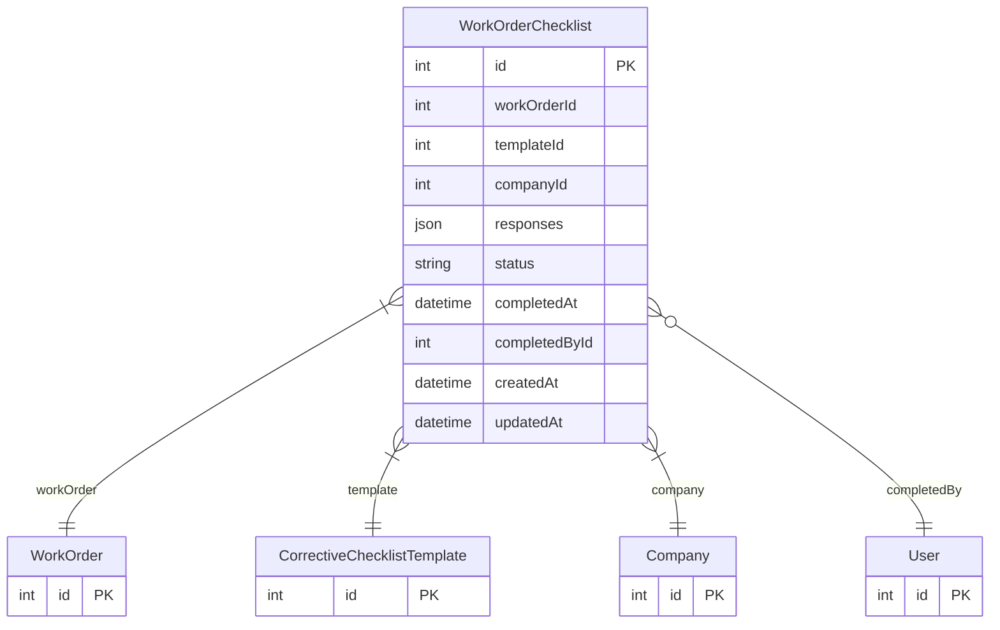

# WorkOrderChecklist

> Table name: `work_order_checklists`

**Schema location:** Lines 5953-5980

## Fields

| Field | Type | Required | Unique | Default | Notes |
|-------|------|----------|--------|---------|-------|
| `id` | `Int` | ✅ | 🔑 PK | `autoincrement(` |  |
| `workOrderId` | `Int` | ✅ |  | `` |  |
| `templateId` | `Int` | ✅ |  | `` |  |
| `companyId` | `Int` | ✅ |  | `` |  |
| `responses` | `Json` | ✅ |  | `` | [{itemId, value, completedAt, completedById}] |
| `status` | `String` | ✅ |  | `"PENDING"` | DB: VarChar(20). PENDING, IN_PROGRESS, COMPLETED |
| `completedAt` | `DateTime?` | ❌ |  | `` |  |
| `completedById` | `Int?` | ❌ |  | `` |  |
| `createdAt` | `DateTime` | ✅ |  | `now(` |  |
| `updatedAt` | `DateTime` | ✅ |  | `` |  |

## Relations

| Field | Type | Cardinality | FK Fields | References | On Delete |
|-------|------|-------------|-----------|------------|-----------|
| `workOrder` | [WorkOrder](./models/WorkOrder.md) | Many-to-One | workOrderId | id | Cascade |
| `template` | [CorrectiveChecklistTemplate](./models/CorrectiveChecklistTemplate.md) | Many-to-One | templateId | id | - |
| `company` | [Company](./models/Company.md) | Many-to-One | companyId | id | Cascade |
| `completedBy` | [User](./models/User.md) | Many-to-One (optional) | completedById | id | - |

## Referenced By

| Model | Field | Cardinality |
|-------|-------|-------------|
| [Company](./models/Company.md) | `workOrderChecklists` | Has many |
| [User](./models/User.md) | `checklistsCompleted` | Has many |
| [WorkOrder](./models/WorkOrder.md) | `workOrderChecklists` | Has many |
| [CorrectiveChecklistTemplate](./models/CorrectiveChecklistTemplate.md) | `workOrderChecklists` | Has many |

## Indexes

- `workOrderId`
- `templateId`
- `workOrderId, companyId`

## Entity Diagram

