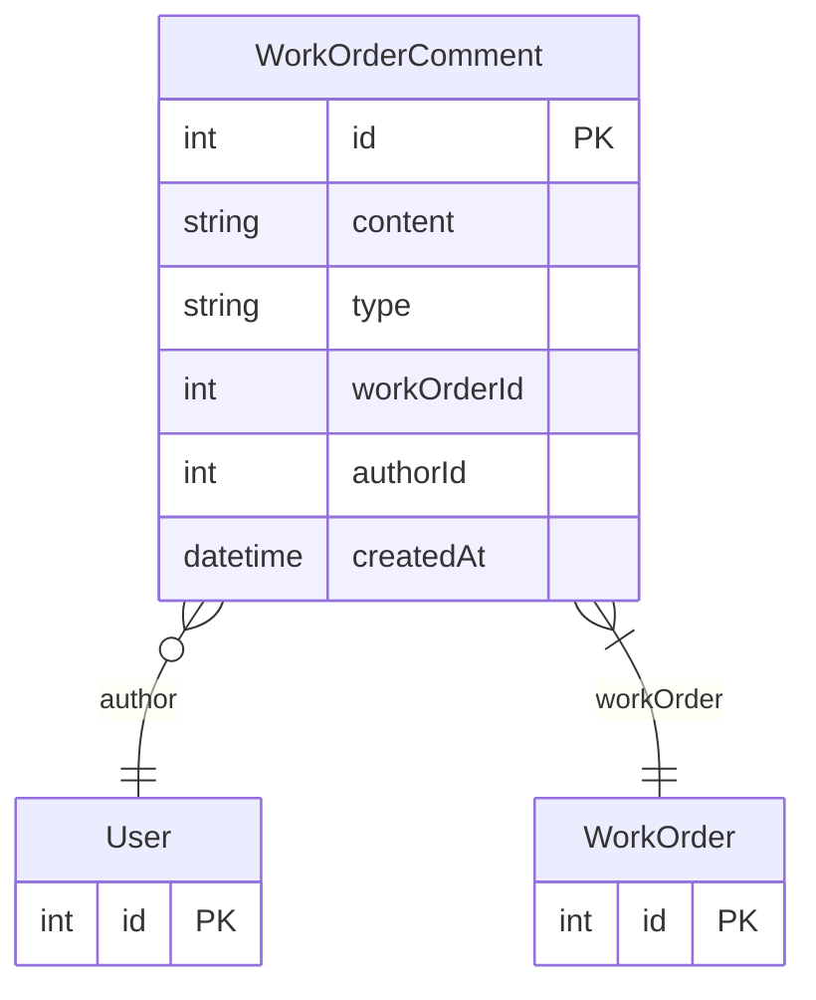

# WorkOrderComment

> Table name: `WorkOrderComment`

**Schema location:** Lines 1869-1881

## Fields

| Field | Type | Required | Unique | Default | Notes |
|-------|------|----------|--------|---------|-------|
| `id` | `Int` | ✅ | 🔑 PK | `autoincrement(` |  |
| `content` | `String` | ✅ |  | `` |  |
| `type` | `String?` | ❌ |  | `"comment"` |  |
| `workOrderId` | `Int` | ✅ |  | `` |  |
| `authorId` | `Int?` | ❌ |  | `` |  |
| `createdAt` | `DateTime` | ✅ |  | `now(` |  |

## Relations

| Field | Type | Cardinality | FK Fields | References | On Delete |
|-------|------|-------------|-----------|------------|-----------|
| `author` | [User](./models/User.md) | Many-to-One (optional) | authorId | id | - |
| `workOrder` | [WorkOrder](./models/WorkOrder.md) | Many-to-One | workOrderId | id | Cascade |

## Referenced By

| Model | Field | Cardinality |
|-------|-------|-------------|
| [User](./models/User.md) | `workOrderComments` | Has many |
| [WorkOrder](./models/WorkOrder.md) | `comments` | Has many |

## Indexes

- `workOrderId`

## Entity Diagram

