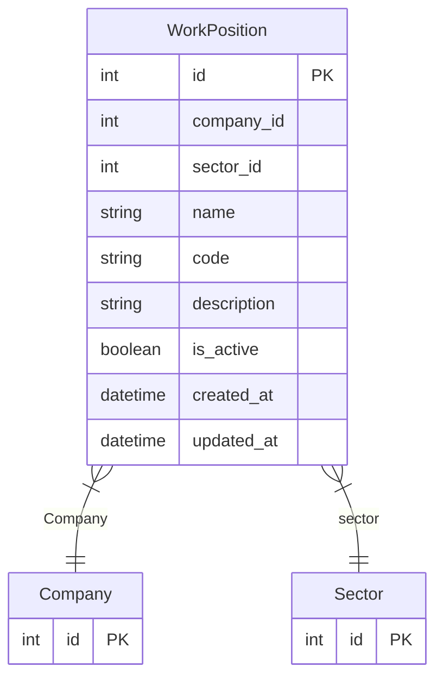

# WorkPosition

> Table name: `work_positions`

**Schema location:** Lines 12071-12090

## Fields

| Field | Type | Required | Unique | Default | Notes |
|-------|------|----------|--------|---------|-------|
| `id` | `Int` | ✅ | 🔑 PK | `autoincrement(` |  |
| `company_id` | `Int` | ✅ |  | `` |  |
| `sector_id` | `Int` | ✅ |  | `` | Sector al que pertenece este puesto |
| `name` | `String` | ✅ |  | `` | DB: VarChar(100). "Zunchado de Paquetes", "Mulero", etc. |
| `code` | `String?` | ❌ |  | `` | DB: VarChar(20) |
| `description` | `String?` | ❌ |  | `` |  |
| `is_active` | `Boolean` | ✅ |  | `true` |  |
| `created_at` | `DateTime` | ✅ |  | `now(` |  |
| `updated_at` | `DateTime` | ✅ |  | `` |  |

## Relations

| Field | Type | Cardinality | FK Fields | References | On Delete |
|-------|------|-------------|-----------|------------|-----------|
| `Company` | [Company](./models/Company.md) | Many-to-One | company_id | id | Cascade |
| `sector` | [Sector](./models/Sector.md) | Many-to-One | sector_id | id | Cascade |

## Referenced By

| Model | Field | Cardinality |
|-------|-------|-------------|
| [Company](./models/Company.md) | `workPositions` | Has many |
| [Sector](./models/Sector.md) | `workPositions` | Has many |

## Indexes

- `company_id`
- `sector_id`

## Unique Constraints

- `company_id, sector_id, name`

## Entity Diagram

