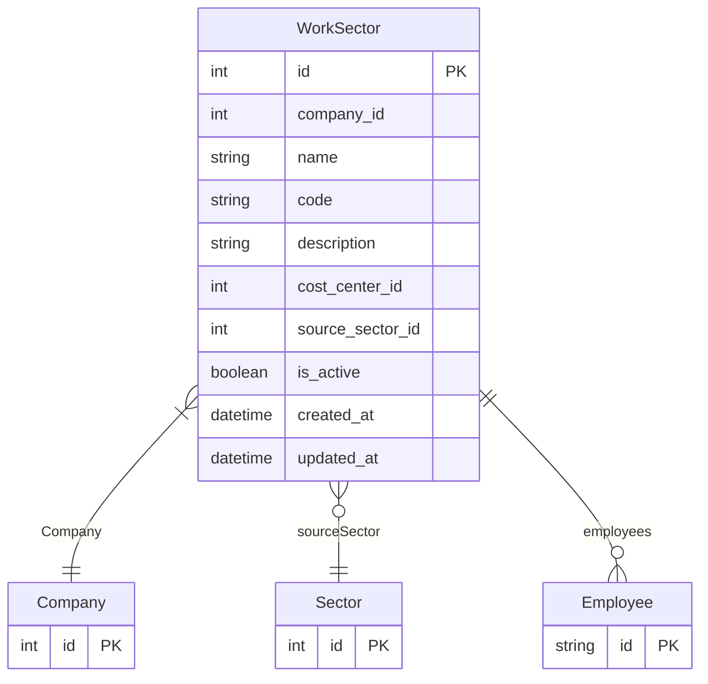

# WorkSector

> Table name: `work_sectors`

**Schema location:** Lines 12047-12068

## Fields

| Field | Type | Required | Unique | Default | Notes |
|-------|------|----------|--------|---------|-------|
| `id` | `Int` | ✅ | 🔑 PK | `autoincrement(` |  |
| `company_id` | `Int` | ✅ |  | `` |  |
| `name` | `String` | ✅ |  | `` | DB: VarChar(100). Albañilería, Electricidad, Oficina |
| `code` | `String?` | ❌ |  | `` | DB: VarChar(20) |
| `description` | `String?` | ❌ |  | `` |  |
| `cost_center_id` | `Int?` | ❌ |  | `` | Opcional: vincular a centro de costo contable |
| `source_sector_id` | `Int?` | ❌ |  | `` | Si fue importado de Sector de mantenimiento |
| `is_active` | `Boolean` | ✅ |  | `true` |  |
| `created_at` | `DateTime` | ✅ |  | `now(` |  |
| `updated_at` | `DateTime` | ✅ |  | `` |  |

## Relations

| Field | Type | Cardinality | FK Fields | References | On Delete |
|-------|------|-------------|-----------|------------|-----------|
| `Company` | [Company](./models/Company.md) | Many-to-One | company_id | id | Cascade |
| `sourceSector` | [Sector](./models/Sector.md) | Many-to-One (optional) | source_sector_id | id | SetNull |
| `employees` | [Employee](./models/Employee.md) | One-to-Many | - | - | - |

## Referenced By

| Model | Field | Cardinality |
|-------|-------|-------------|
| [Company](./models/Company.md) | `workSectors` | Has many |
| [Sector](./models/Sector.md) | `workSectors` | Has many |
| [Employee](./models/Employee.md) | `workSector` | Has one |

## Indexes

- `company_id`
- `source_sector_id`

## Unique Constraints

- `company_id, name`

## Entity Diagram

