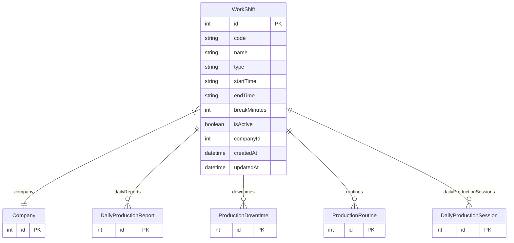

# WorkShift

> Table name: `work_shifts`

**Schema location:** Lines 13433-13455

## Fields

| Field | Type | Required | Unique | Default | Notes |
|-------|------|----------|--------|---------|-------|
| `id` | `Int` | ✅ | 🔑 PK | `autoincrement(` |  |
| `code` | `String` | ✅ |  | `` |  |
| `name` | `String` | ✅ |  | `` |  |
| `type` | `String` | ✅ |  | `` | 'MORNING', 'AFTERNOON', 'NIGHT', 'SPLIT', custom |
| `startTime` | `String` | ✅ |  | `` | "06:00" |
| `endTime` | `String` | ✅ |  | `` | "14:00" |
| `breakMinutes` | `Int` | ✅ |  | `30` |  |
| `isActive` | `Boolean` | ✅ |  | `true` |  |
| `companyId` | `Int` | ✅ |  | `` |  |
| `createdAt` | `DateTime` | ✅ |  | `now(` |  |
| `updatedAt` | `DateTime` | ✅ |  | `` |  |

## Relations

| Field | Type | Cardinality | FK Fields | References | On Delete |
|-------|------|-------------|-----------|------------|-----------|
| `company` | [Company](./models/Company.md) | Many-to-One | companyId | id | Cascade |
| `dailyReports` | [DailyProductionReport](./models/DailyProductionReport.md) | One-to-Many | - | - | - |
| `downtimes` | [ProductionDowntime](./models/ProductionDowntime.md) | One-to-Many | - | - | - |
| `routines` | [ProductionRoutine](./models/ProductionRoutine.md) | One-to-Many | - | - | - |
| `dailyProductionSessions` | [DailyProductionSession](./models/DailyProductionSession.md) | One-to-Many | - | - | - |

## Referenced By

| Model | Field | Cardinality |
|-------|-------|-------------|
| [Company](./models/Company.md) | `workShifts` | Has many |
| [DailyProductionReport](./models/DailyProductionReport.md) | `shift` | Has one |
| [ProductionDowntime](./models/ProductionDowntime.md) | `shift` | Has one |
| [ProductionRoutine](./models/ProductionRoutine.md) | `shift` | Has one |
| [DailyProductionSession](./models/DailyProductionSession.md) | `shift` | Has one |

## Indexes

- `companyId, isActive`

## Unique Constraints

- `companyId, code`

## Entity Diagram

