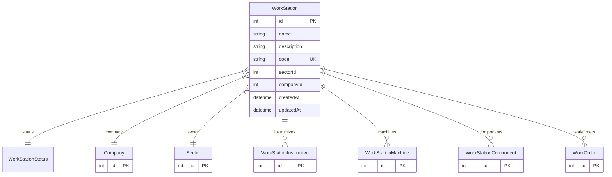

# WorkStation

> Table name: `WorkStation`

**Schema location:** Lines 2513-2532

## Fields

| Field | Type | Required | Unique | Default | Notes |
|-------|------|----------|--------|---------|-------|
| `id` | `Int` | ✅ | 🔑 PK | `autoincrement(` |  |
| `name` | `String` | ✅ |  | `` |  |
| `description` | `String?` | ❌ |  | `` |  |
| `code` | `String` | ✅ | ✅ | `` |  |
| `sectorId` | `Int` | ✅ |  | `` |  |
| `companyId` | `Int` | ✅ |  | `` |  |
| `createdAt` | `DateTime` | ✅ |  | `now(` |  |
| `updatedAt` | `DateTime` | ✅ |  | `` |  |

## Relations

| Field | Type | Cardinality | FK Fields | References | On Delete |
|-------|------|-------------|-----------|------------|-----------|
| `status` | [WorkStationStatus](./models/WorkStationStatus.md) | Many-to-One | - | - | - |
| `company` | [Company](./models/Company.md) | Many-to-One | companyId | id | Cascade |
| `sector` | [Sector](./models/Sector.md) | Many-to-One | sectorId | id | Cascade |
| `instructives` | [WorkStationInstructive](./models/WorkStationInstructive.md) | One-to-Many | - | - | - |
| `machines` | [WorkStationMachine](./models/WorkStationMachine.md) | One-to-Many | - | - | - |
| `components` | [WorkStationComponent](./models/WorkStationComponent.md) | One-to-Many | - | - | - |
| `workOrders` | [WorkOrder](./models/WorkOrder.md) | One-to-Many | - | - | - |

## Referenced By

| Model | Field | Cardinality |
|-------|-------|-------------|
| [Company](./models/Company.md) | `workStations` | Has many |
| [Sector](./models/Sector.md) | `workStations` | Has many |
| [WorkOrder](./models/WorkOrder.md) | `workStation` | Has one |
| [WorkStationInstructive](./models/WorkStationInstructive.md) | `workStation` | Has one |
| [WorkStationMachine](./models/WorkStationMachine.md) | `workStation` | Has one |
| [WorkStationComponent](./models/WorkStationComponent.md) | `workStation` | Has one |

## Unique Constraints

- `name, sectorId`

## Entity Diagram

