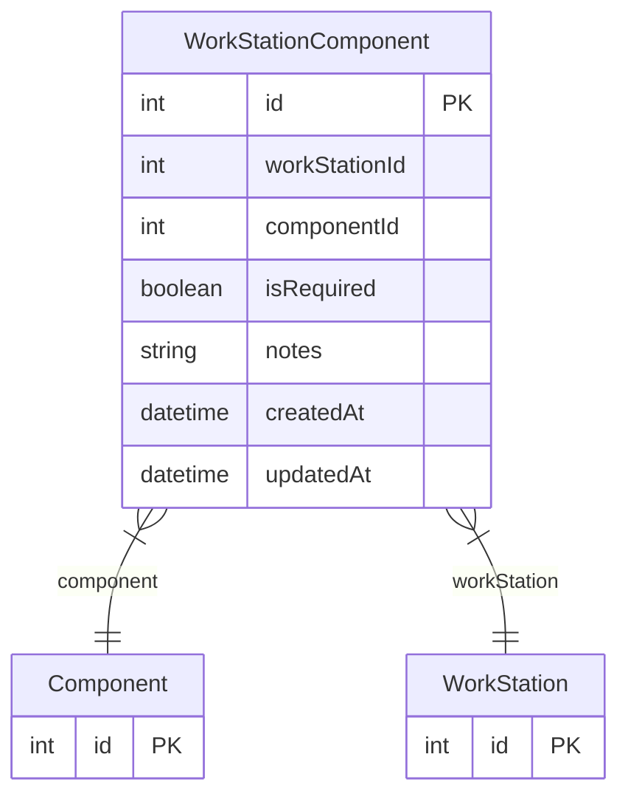

# WorkStationComponent

> Table name: `WorkStationComponent`

**Schema location:** Lines 2572-2585

## Fields

| Field | Type | Required | Unique | Default | Notes |
|-------|------|----------|--------|---------|-------|
| `id` | `Int` | ✅ | 🔑 PK | `autoincrement(` |  |
| `workStationId` | `Int` | ✅ |  | `` |  |
| `componentId` | `Int` | ✅ |  | `` |  |
| `isRequired` | `Boolean` | ✅ |  | `true` |  |
| `notes` | `String?` | ❌ |  | `` |  |
| `createdAt` | `DateTime` | ✅ |  | `now(` |  |
| `updatedAt` | `DateTime` | ✅ |  | `` |  |

## Relations

| Field | Type | Cardinality | FK Fields | References | On Delete |
|-------|------|-------------|-----------|------------|-----------|
| `component` | [Component](./models/Component.md) | Many-to-One | componentId | id | Cascade |
| `workStation` | [WorkStation](./models/WorkStation.md) | Many-to-One | workStationId | id | Cascade |

## Referenced By

| Model | Field | Cardinality |
|-------|-------|-------------|
| [Component](./models/Component.md) | `workStations` | Has many |
| [WorkStation](./models/WorkStation.md) | `components` | Has many |

## Unique Constraints

- `workStationId, componentId`

## Entity Diagram

