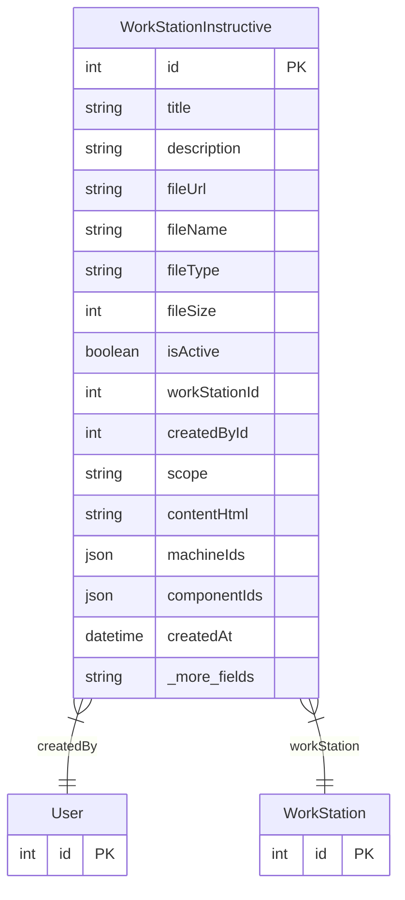

# WorkStationInstructive

> Table name: `WorkStationInstructive`

**Schema location:** Lines 2534-2555

## Fields

| Field | Type | Required | Unique | Default | Notes |
|-------|------|----------|--------|---------|-------|
| `id` | `Int` | ✅ | 🔑 PK | `autoincrement(` |  |
| `title` | `String` | ✅ |  | `` |  |
| `description` | `String?` | ❌ |  | `` |  |
| `fileUrl` | `String?` | ❌ |  | `` |  |
| `fileName` | `String?` | ❌ |  | `` |  |
| `fileType` | `String?` | ❌ |  | `` |  |
| `fileSize` | `Int?` | ❌ |  | `` |  |
| `isActive` | `Boolean` | ✅ |  | `true` |  |
| `workStationId` | `Int` | ✅ |  | `` |  |
| `createdById` | `Int` | ✅ |  | `` |  |
| `scope` | `String?` | ❌ |  | `` |  |
| `contentHtml` | `String?` | ❌ |  | `` |  |
| `machineIds` | `Json?` | ❌ |  | `` |  |
| `componentIds` | `Json?` | ❌ |  | `` |  |
| `createdAt` | `DateTime` | ✅ |  | `now(` |  |
| `updatedAt` | `DateTime` | ✅ |  | `` |  |

## Relations

| Field | Type | Cardinality | FK Fields | References | On Delete |
|-------|------|-------------|-----------|------------|-----------|
| `createdBy` | [User](./models/User.md) | Many-to-One | createdById | id | - |
| `workStation` | [WorkStation](./models/WorkStation.md) | Many-to-One | workStationId | id | Cascade |

## Referenced By

| Model | Field | Cardinality |
|-------|-------|-------------|
| [User](./models/User.md) | `workStations` | Has many |
| [WorkStation](./models/WorkStation.md) | `instructives` | Has many |

## Entity Diagram

