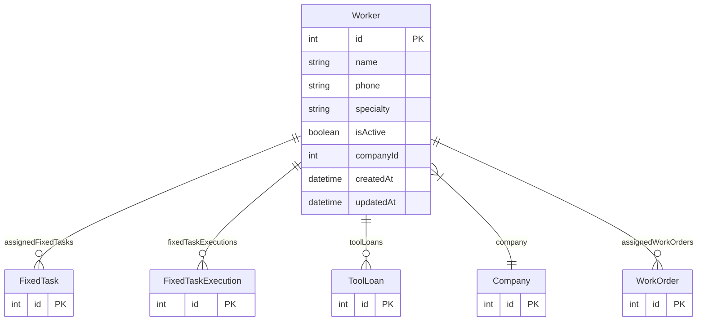

# Worker

> Table name: `Worker`

**Schema location:** Lines 1512-1528

## Fields

| Field | Type | Required | Unique | Default | Notes |
|-------|------|----------|--------|---------|-------|
| `id` | `Int` | ✅ | 🔑 PK | `autoincrement(` |  |
| `name` | `String` | ✅ |  | `` |  |
| `phone` | `String?` | ❌ |  | `` |  |
| `specialty` | `String?` | ❌ |  | `` |  |
| `isActive` | `Boolean` | ✅ |  | `true` |  |
| `companyId` | `Int` | ✅ |  | `` |  |
| `createdAt` | `DateTime` | ✅ |  | `now(` |  |
| `updatedAt` | `DateTime` | ✅ |  | `` |  |

## Relations

| Field | Type | Cardinality | FK Fields | References | On Delete |
|-------|------|-------------|-----------|------------|-----------|
| `assignedFixedTasks` | [FixedTask](./models/FixedTask.md) | One-to-Many | - | - | - |
| `fixedTaskExecutions` | [FixedTaskExecution](./models/FixedTaskExecution.md) | One-to-Many | - | - | - |
| `toolLoans` | [ToolLoan](./models/ToolLoan.md) | One-to-Many | - | - | - |
| `company` | [Company](./models/Company.md) | Many-to-One | companyId | id | Cascade |
| `assignedWorkOrders` | [WorkOrder](./models/WorkOrder.md) | One-to-Many | - | - | - |

## Referenced By

| Model | Field | Cardinality |
|-------|-------|-------------|
| [Company](./models/Company.md) | `workers` | Has many |
| [ToolLoan](./models/ToolLoan.md) | `worker` | Has one |
| [WorkOrder](./models/WorkOrder.md) | `assignedWorker` | Has one |
| [FixedTask](./models/FixedTask.md) | `assignedWorker` | Has one |
| [FixedTaskExecution](./models/FixedTaskExecution.md) | `worker` | Has one |

## Entity Diagram

