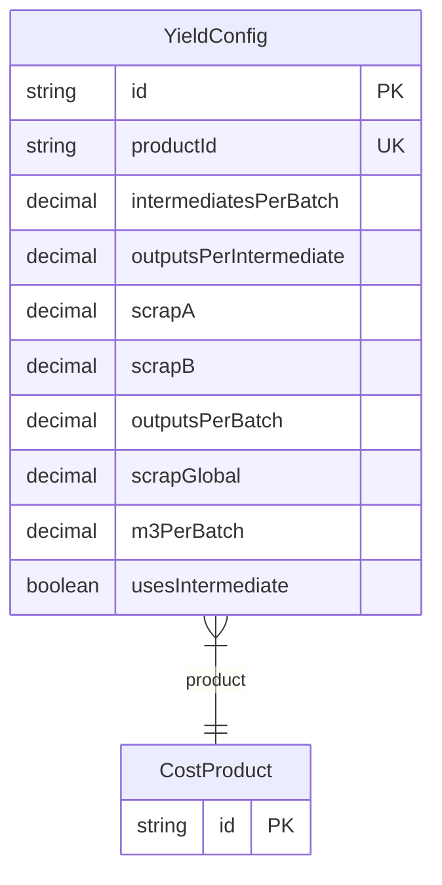

# YieldConfig

> Table name: `YieldConfig`

**Schema location:** Lines 2828-2842

## Fields

| Field | Type | Required | Unique | Default | Notes |
|-------|------|----------|--------|---------|-------|
| `id` | `String` | ✅ | 🔑 PK | `uuid(` |  |
| `productId` | `String` | ✅ | ✅ | `` |  |
| `intermediatesPerBatch` | `Decimal?` | ❌ |  | `` | DB: Decimal(12, 4) |
| `outputsPerIntermediate` | `Decimal?` | ❌ |  | `` | DB: Decimal(12, 4) |
| `scrapA` | `Decimal?` | ❌ |  | `` | DB: Decimal(5, 4) |
| `scrapB` | `Decimal?` | ❌ |  | `` | DB: Decimal(5, 4) |
| `outputsPerBatch` | `Decimal?` | ❌ |  | `` | DB: Decimal(12, 4) |
| `scrapGlobal` | `Decimal?` | ❌ |  | `` | DB: Decimal(5, 4) |
| `m3PerBatch` | `Decimal?` | ❌ |  | `` | DB: Decimal(12, 4) |
| `usesIntermediate` | `Boolean` | ✅ |  | `false` |  |

## Relations

| Field | Type | Cardinality | FK Fields | References | On Delete |
|-------|------|-------------|-----------|------------|-----------|
| `product` | [CostProduct](./models/CostProduct.md) | Many-to-One | productId | id | Cascade |

## Referenced By

| Model | Field | Cardinality |
|-------|-------|-------------|
| [CostProduct](./models/CostProduct.md) | `yieldConfig` | Has one |

## Entity Diagram

