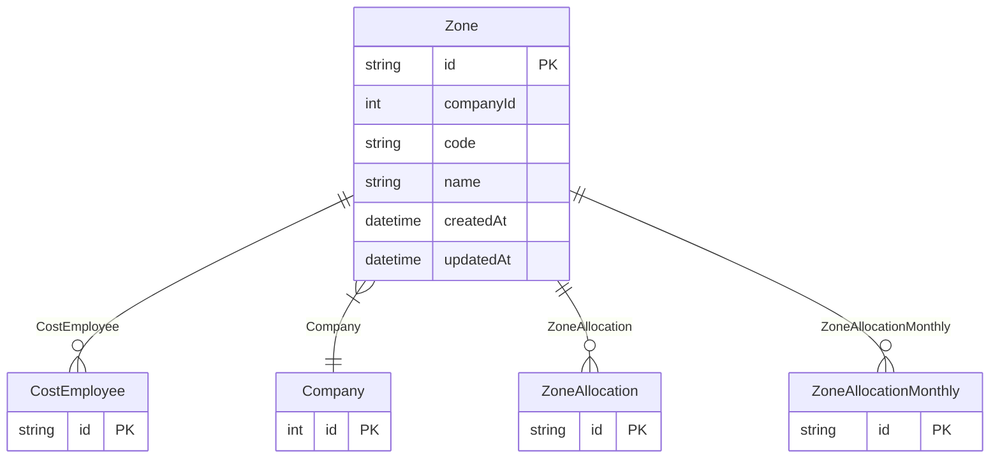

# Zone

**Schema location:** Lines 3090-3104

## Fields

| Field | Type | Required | Unique | Default | Notes |
|-------|------|----------|--------|---------|-------|
| `id` | `String` | ✅ | 🔑 PK | `` |  |
| `companyId` | `Int` | ✅ |  | `` |  |
| `code` | `String` | ✅ |  | `` |  |
| `name` | `String` | ✅ |  | `` |  |
| `createdAt` | `DateTime` | ✅ |  | `now(` |  |
| `updatedAt` | `DateTime` | ✅ |  | `` |  |

## Relations

| Field | Type | Cardinality | FK Fields | References | On Delete |
|-------|------|-------------|-----------|------------|-----------|
| `CostEmployee` | [CostEmployee](./models/CostEmployee.md) | One-to-Many | - | - | - |
| `Company` | [Company](./models/Company.md) | Many-to-One | companyId | id | Cascade |
| `ZoneAllocation` | [ZoneAllocation](./models/ZoneAllocation.md) | One-to-Many | - | - | - |
| `ZoneAllocationMonthly` | [ZoneAllocationMonthly](./models/ZoneAllocationMonthly.md) | One-to-Many | - | - | - |

## Referenced By

| Model | Field | Cardinality |
|-------|-------|-------------|
| [Company](./models/Company.md) | `Zone` | Has many |
| [CostEmployee](./models/CostEmployee.md) | `Zone` | Has one |
| [ZoneAllocation](./models/ZoneAllocation.md) | `Zone` | Has one |
| [ZoneAllocationMonthly](./models/ZoneAllocationMonthly.md) | `Zone` | Has one |

## Indexes

- `companyId, name`

## Unique Constraints

- `companyId, code`

## Entity Diagram

