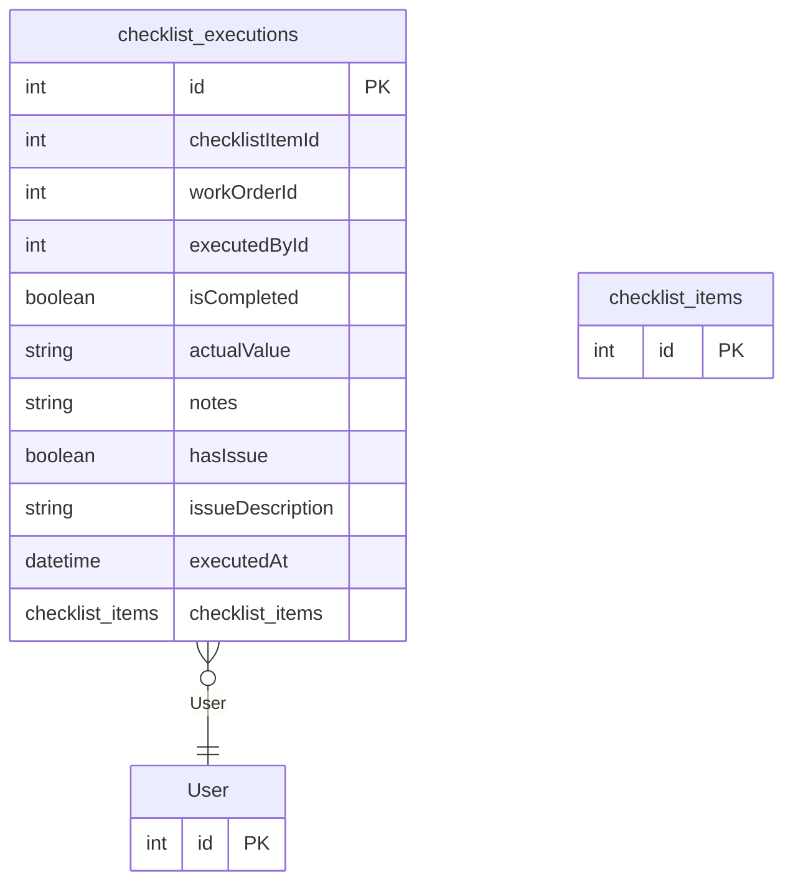

# checklist_executions

**Schema location:** Lines 4970-4983

## Fields

| Field | Type | Required | Unique | Default | Notes |
|-------|------|----------|--------|---------|-------|
| `id` | `Int` | ✅ | 🔑 PK | `autoincrement(` |  |
| `checklistItemId` | `Int` | ✅ |  | `` |  |
| `workOrderId` | `Int?` | ❌ |  | `` |  |
| `executedById` | `Int?` | ❌ |  | `` |  |
| `isCompleted` | `Boolean` | ✅ |  | `false` |  |
| `actualValue` | `String?` | ❌ |  | `` |  |
| `notes` | `String?` | ❌ |  | `` |  |
| `hasIssue` | `Boolean` | ✅ |  | `false` |  |
| `issueDescription` | `String?` | ❌ |  | `` |  |
| `executedAt` | `DateTime` | ✅ |  | `now(` |  |
| `checklist_items` | `checklist_items` | ✅ |  | `` |  |

## Relations

| Field | Type | Cardinality | FK Fields | References | On Delete |
|-------|------|-------------|-----------|------------|-----------|
| `User` | [User](./models/User.md) | Many-to-One (optional) | executedById | id | - |

## Referenced By

| Model | Field | Cardinality |
|-------|-------|-------------|
| [User](./models/User.md) | `checklist_executions` | Has many |
| [checklist_items](./models/checklist_items.md) | `checklist_executions` | Has many |

## Entity Diagram

