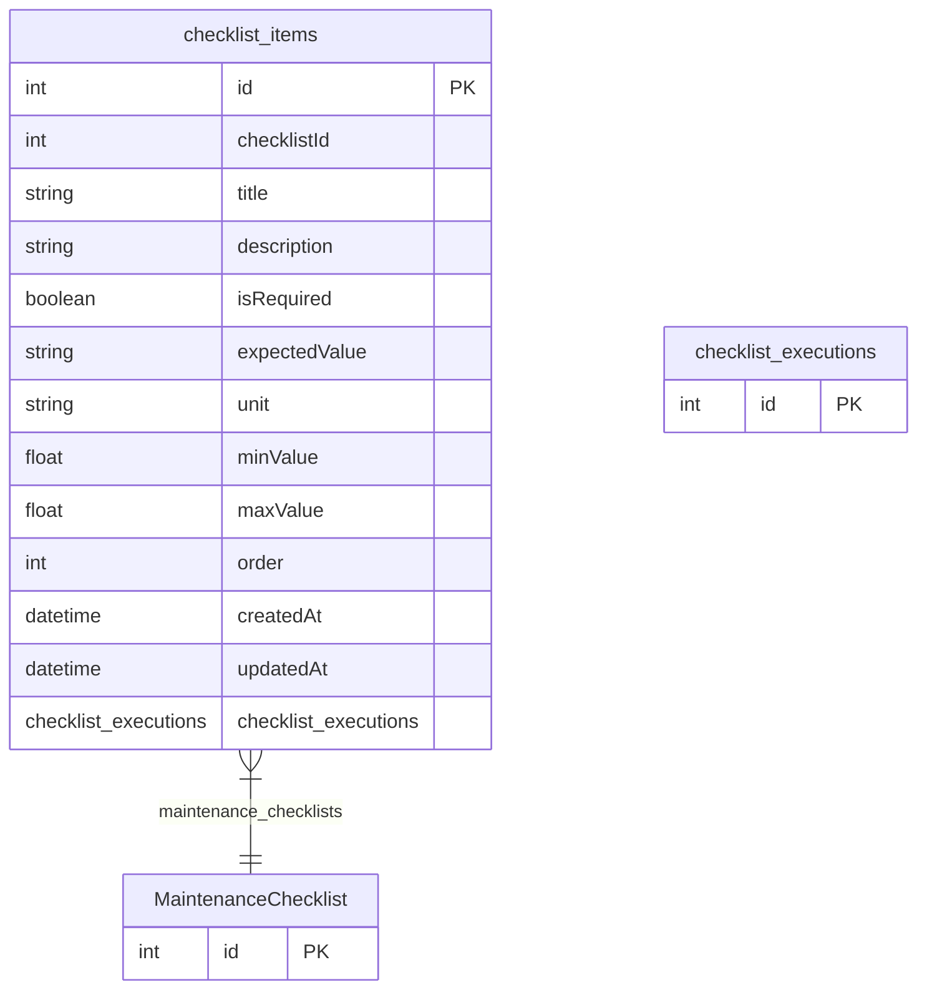

# checklist_items

**Schema location:** Lines 4985-5000

## Fields

| Field | Type | Required | Unique | Default | Notes |
|-------|------|----------|--------|---------|-------|
| `id` | `Int` | ✅ | 🔑 PK | `autoincrement(` |  |
| `checklistId` | `Int` | ✅ |  | `` |  |
| `title` | `String` | ✅ |  | `` |  |
| `description` | `String?` | ❌ |  | `` |  |
| `isRequired` | `Boolean` | ✅ |  | `true` |  |
| `expectedValue` | `String?` | ❌ |  | `` |  |
| `unit` | `String?` | ❌ |  | `` |  |
| `minValue` | `Float?` | ❌ |  | `` |  |
| `maxValue` | `Float?` | ❌ |  | `` |  |
| `order` | `Int` | ✅ |  | `0` |  |
| `createdAt` | `DateTime` | ✅ |  | `now(` |  |
| `updatedAt` | `DateTime` | ✅ |  | `` |  |
| `checklist_executions` | `checklist_executions[]` | ✅ |  | `` |  |

## Relations

| Field | Type | Cardinality | FK Fields | References | On Delete |
|-------|------|-------------|-----------|------------|-----------|
| `maintenance_checklists` | [MaintenanceChecklist](./models/MaintenanceChecklist.md) | Many-to-One | checklistId | id | Cascade |

## Referenced By

| Model | Field | Cardinality |
|-------|-------|-------------|
| [MaintenanceChecklist](./models/MaintenanceChecklist.md) | `checklist_items` | Has many |
| [checklist_executions](./models/checklist_executions.md) | `checklist_items` | Has one |

## Entity Diagram

