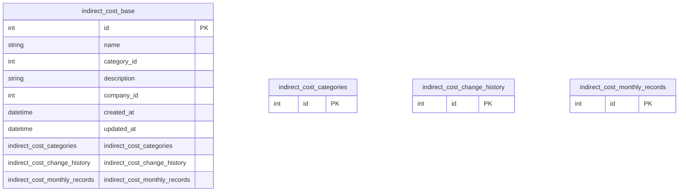

# indirect_cost_base

**Schema location:** Lines 3404-3417

## Fields

| Field | Type | Required | Unique | Default | Notes |
|-------|------|----------|--------|---------|-------|
| `id` | `Int` | ✅ | 🔑 PK | `autoincrement(` |  |
| `name` | `String` | ✅ |  | `` | DB: VarChar |
| `category_id` | `Int` | ✅ |  | `` |  |
| `description` | `String?` | ❌ |  | `` |  |
| `company_id` | `Int` | ✅ |  | `` |  |
| `created_at` | `DateTime?` | ❌ |  | `now(` | DB: Timestamp(6) |
| `updated_at` | `DateTime?` | ❌ |  | `now(` | DB: Timestamp(6) |
| `indirect_cost_categories` | `indirect_cost_categories` | ✅ |  | `` |  |
| `indirect_cost_change_history` | `indirect_cost_change_history[]` | ✅ |  | `` |  |
| `indirect_cost_monthly_records` | `indirect_cost_monthly_records[]` | ✅ |  | `` |  |

## Referenced By

| Model | Field | Cardinality |
|-------|-------|-------------|
| [indirect_cost_categories](./models/indirect_cost_categories.md) | `indirect_cost_base` | Has many |
| [indirect_cost_change_history](./models/indirect_cost_change_history.md) | `indirect_cost_base` | Has one |
| [indirect_cost_monthly_records](./models/indirect_cost_monthly_records.md) | `indirect_cost_base` | Has one |

## Indexes

- `company_id`

## Entity Diagram

