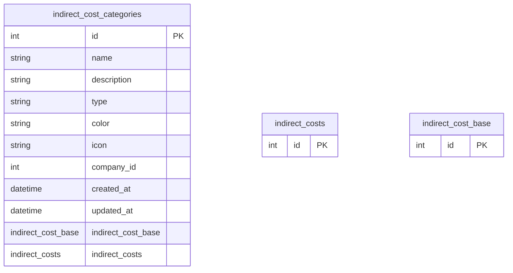

# indirect_cost_categories

**Schema location:** Lines 3353-3367

## Fields

| Field | Type | Required | Unique | Default | Notes |
|-------|------|----------|--------|---------|-------|
| `id` | `Int` | ✅ | 🔑 PK | `autoincrement(` |  |
| `name` | `String` | ✅ |  | `` | DB: VarChar(255) |
| `description` | `String?` | ❌ |  | `` |  |
| `type` | `String` | ✅ |  | `` | DB: VarChar(50) |
| `color` | `String?` | ❌ |  | `"#3B82F6"` | DB: VarChar(7) |
| `icon` | `String?` | ❌ |  | `"Building2"` | DB: VarChar(100) |
| `company_id` | `Int` | ✅ |  | `` |  |
| `created_at` | `DateTime?` | ❌ |  | `now(` | DB: Timestamp(6) |
| `updated_at` | `DateTime?` | ❌ |  | `now(` | DB: Timestamp(6) |
| `indirect_cost_base` | `indirect_cost_base[]` | ✅ |  | `` |  |
| `indirect_costs` | `indirect_costs[]` | ✅ |  | `` |  |

## Referenced By

| Model | Field | Cardinality |
|-------|-------|-------------|
| [indirect_costs](./models/indirect_costs.md) | `indirect_cost_categories` | Has one |
| [indirect_cost_base](./models/indirect_cost_base.md) | `indirect_cost_categories` | Has one |

## Indexes

- `company_id`

## Entity Diagram

