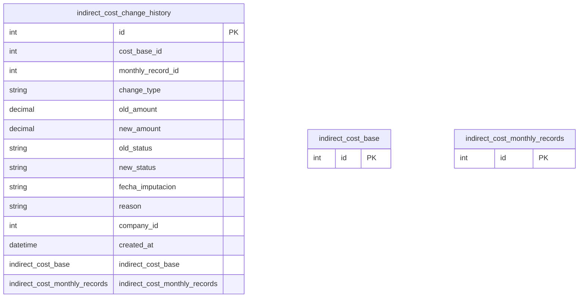

# indirect_cost_change_history

**Schema location:** Lines 3419-3437

## Fields

| Field | Type | Required | Unique | Default | Notes |
|-------|------|----------|--------|---------|-------|
| `id` | `Int` | ✅ | 🔑 PK | `autoincrement(` |  |
| `cost_base_id` | `Int` | ✅ |  | `` |  |
| `monthly_record_id` | `Int?` | ❌ |  | `` |  |
| `change_type` | `String` | ✅ |  | `` | DB: VarChar |
| `old_amount` | `Decimal?` | ❌ |  | `` | DB: Decimal |
| `new_amount` | `Decimal?` | ❌ |  | `` | DB: Decimal |
| `old_status` | `String?` | ❌ |  | `` | DB: VarChar |
| `new_status` | `String?` | ❌ |  | `` | DB: VarChar |
| `fecha_imputacion` | `String?` | ❌ |  | `` | DB: VarChar |
| `reason` | `String?` | ❌ |  | `` |  |
| `company_id` | `Int` | ✅ |  | `` |  |
| `created_at` | `DateTime?` | ❌ |  | `now(` | DB: Timestamp(6) |
| `indirect_cost_base` | `indirect_cost_base` | ✅ |  | `` |  |
| `indirect_cost_monthly_records` | `indirect_cost_monthly_records?` | ❌ |  | `` |  |

## Referenced By

| Model | Field | Cardinality |
|-------|-------|-------------|
| [indirect_cost_base](./models/indirect_cost_base.md) | `indirect_cost_change_history` | Has many |
| [indirect_cost_monthly_records](./models/indirect_cost_monthly_records.md) | `indirect_cost_change_history` | Has many |

## Indexes

- `cost_base_id`
- `company_id`

## Entity Diagram

