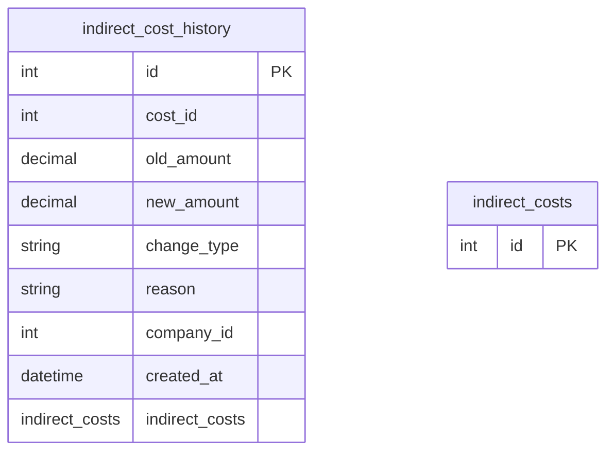

# indirect_cost_history

**Schema location:** Lines 3389-3402

## Fields

| Field | Type | Required | Unique | Default | Notes |
|-------|------|----------|--------|---------|-------|
| `id` | `Int` | ✅ | 🔑 PK | `autoincrement(` |  |
| `cost_id` | `Int` | ✅ |  | `` |  |
| `old_amount` | `Decimal?` | ❌ |  | `` | DB: Decimal(15, 2) |
| `new_amount` | `Decimal` | ✅ |  | `` | DB: Decimal(15, 2) |
| `change_type` | `String` | ✅ |  | `` | DB: VarChar(50) |
| `reason` | `String?` | ❌ |  | `` |  |
| `company_id` | `Int` | ✅ |  | `` |  |
| `created_at` | `DateTime?` | ❌ |  | `now(` | DB: Timestamp(6) |
| `indirect_costs` | `indirect_costs` | ✅ |  | `` |  |

## Referenced By

| Model | Field | Cardinality |
|-------|-------|-------------|
| [indirect_costs](./models/indirect_costs.md) | `indirect_cost_history` | Has many |

## Indexes

- `cost_id`
- `company_id`

## Entity Diagram

