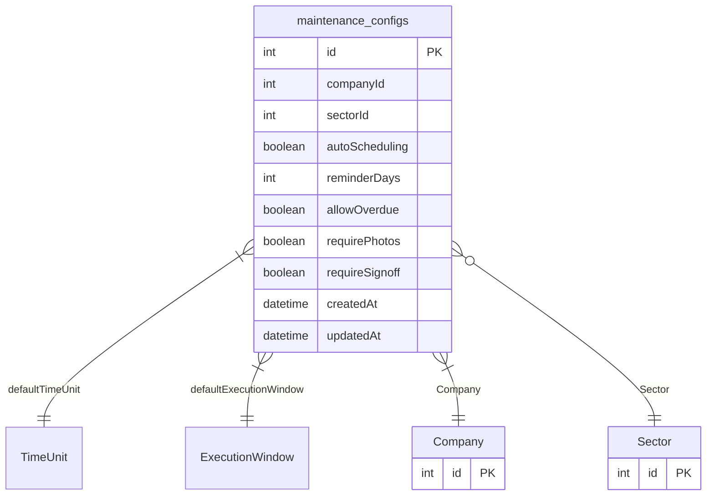

# maintenance_configs

**Schema location:** Lines 5013-5030

## Fields

| Field | Type | Required | Unique | Default | Notes |
|-------|------|----------|--------|---------|-------|
| `id` | `Int` | ✅ | 🔑 PK | `autoincrement(` |  |
| `companyId` | `Int` | ✅ |  | `` |  |
| `sectorId` | `Int?` | ❌ |  | `` |  |
| `autoScheduling` | `Boolean` | ✅ |  | `true` |  |
| `reminderDays` | `Int` | ✅ |  | `3` |  |
| `allowOverdue` | `Boolean` | ✅ |  | `true` |  |
| `requirePhotos` | `Boolean` | ✅ |  | `false` |  |
| `requireSignoff` | `Boolean` | ✅ |  | `false` |  |
| `createdAt` | `DateTime` | ✅ |  | `now(` |  |
| `updatedAt` | `DateTime` | ✅ |  | `` |  |

## Relations

| Field | Type | Cardinality | FK Fields | References | On Delete |
|-------|------|-------------|-----------|------------|-----------|
| `defaultTimeUnit` | [TimeUnit](./models/TimeUnit.md) | Many-to-One | - | - | - |
| `defaultExecutionWindow` | [ExecutionWindow](./models/ExecutionWindow.md) | Many-to-One | - | - | - |
| `Company` | [Company](./models/Company.md) | Many-to-One | companyId | id | Cascade |
| `Sector` | [Sector](./models/Sector.md) | Many-to-One (optional) | sectorId | id | - |

## Referenced By

| Model | Field | Cardinality |
|-------|-------|-------------|
| [Company](./models/Company.md) | `maintenance_configs` | Has many |
| [Sector](./models/Sector.md) | `maintenance_configs` | Has many |

## Unique Constraints

- `companyId, sectorId`

## Entity Diagram

