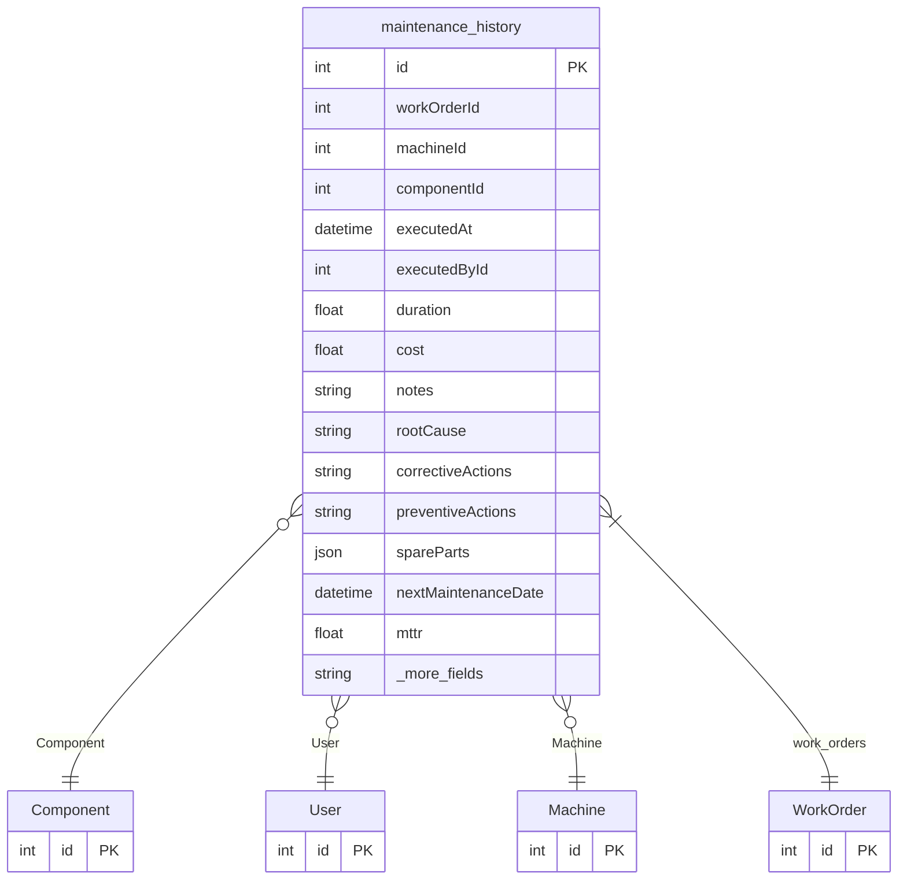

# maintenance_history

**Schema location:** Lines 5032-5057

## Fields

| Field | Type | Required | Unique | Default | Notes |
|-------|------|----------|--------|---------|-------|
| `id` | `Int` | ✅ | 🔑 PK | `autoincrement(` |  |
| `workOrderId` | `Int` | ✅ |  | `` |  |
| `machineId` | `Int?` | ❌ |  | `` |  |
| `componentId` | `Int?` | ❌ |  | `` |  |
| `executedAt` | `DateTime` | ✅ |  | `` |  |
| `executedById` | `Int?` | ❌ |  | `` |  |
| `duration` | `Float?` | ❌ |  | `` |  |
| `cost` | `Float?` | ❌ |  | `` |  |
| `notes` | `String?` | ❌ |  | `` |  |
| `rootCause` | `String?` | ❌ |  | `` |  |
| `correctiveActions` | `String?` | ❌ |  | `` |  |
| `preventiveActions` | `String?` | ❌ |  | `` |  |
| `spareParts` | `Json?` | ❌ |  | `` |  |
| `nextMaintenanceDate` | `DateTime?` | ❌ |  | `` |  |
| `mttr` | `Float?` | ❌ |  | `` |  |
| `mtbf` | `Float?` | ❌ |  | `` |  |
| `completionRate` | `Float?` | ❌ |  | `` |  |
| `qualityScore` | `Float?` | ❌ |  | `` |  |
| `createdAt` | `DateTime` | ✅ |  | `now(` |  |
| `updatedAt` | `DateTime` | ✅ |  | `` |  |

## Relations

| Field | Type | Cardinality | FK Fields | References | On Delete |
|-------|------|-------------|-----------|------------|-----------|
| `Component` | [Component](./models/Component.md) | Many-to-One (optional) | componentId | id | - |
| `User` | [User](./models/User.md) | Many-to-One (optional) | executedById | id | - |
| `Machine` | [Machine](./models/Machine.md) | Many-to-One (optional) | machineId | id | - |
| `work_orders` | [WorkOrder](./models/WorkOrder.md) | Many-to-One | workOrderId | id | Cascade |

## Referenced By

| Model | Field | Cardinality |
|-------|-------|-------------|
| [User](./models/User.md) | `maintenance_history` | Has many |
| [Machine](./models/Machine.md) | `maintenance_history` | Has many |
| [Component](./models/Component.md) | `maintenance_history` | Has many |
| [WorkOrder](./models/WorkOrder.md) | `maintenance_history` | Has many |

## Entity Diagram

