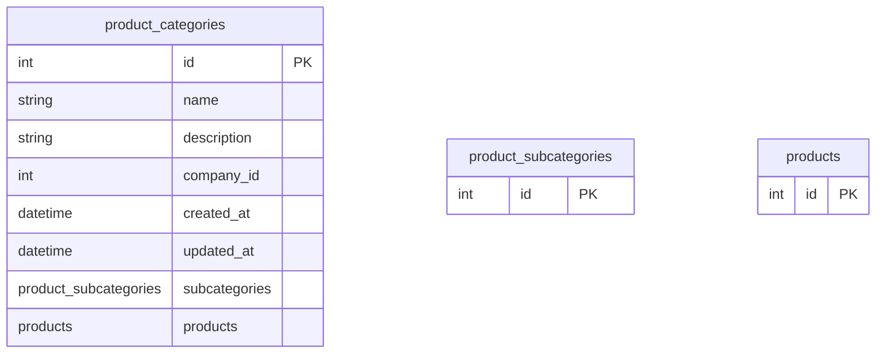

# product_categories

**Schema location:** Lines 3458-3467

## Fields

| Field | Type | Required | Unique | Default | Notes |
|-------|------|----------|--------|---------|-------|
| `id` | `Int` | ✅ | 🔑 PK | `autoincrement(` |  |
| `name` | `String` | ✅ |  | `` | DB: VarChar(255) |
| `description` | `String?` | ❌ |  | `` |  |
| `company_id` | `Int` | ✅ |  | `` |  |
| `created_at` | `DateTime?` | ❌ |  | `now(` | DB: Timestamp(6) |
| `updated_at` | `DateTime?` | ❌ |  | `now(` | DB: Timestamp(6) |
| `subcategories` | `product_subcategories[]` | ✅ |  | `` |  |
| `products` | `products[]` | ✅ |  | `` |  |

## Referenced By

| Model | Field | Cardinality |
|-------|-------|-------------|
| [product_subcategories](./models/product_subcategories.md) | `category` | Has one |
| [products](./models/products.md) | `product_categories` | Has one |

## Entity Diagram

