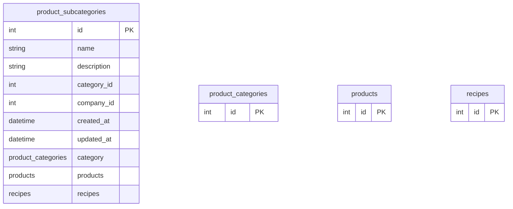

# product_subcategories

**Schema location:** Lines 3469-3480

## Fields

| Field | Type | Required | Unique | Default | Notes |
|-------|------|----------|--------|---------|-------|
| `id` | `Int` | ✅ | 🔑 PK | `autoincrement(` |  |
| `name` | `String` | ✅ |  | `` | DB: VarChar(255) |
| `description` | `String?` | ❌ |  | `` |  |
| `category_id` | `Int` | ✅ |  | `` |  |
| `company_id` | `Int` | ✅ |  | `` |  |
| `created_at` | `DateTime?` | ❌ |  | `now(` | DB: Timestamp(6) |
| `updated_at` | `DateTime?` | ❌ |  | `now(` | DB: Timestamp(6) |
| `category` | `product_categories` | ✅ |  | `` |  |
| `products` | `products[]` | ✅ |  | `` |  |
| `recipes` | `recipes[]` | ✅ |  | `` |  |

## Referenced By

| Model | Field | Cardinality |
|-------|-------|-------------|
| [product_categories](./models/product_categories.md) | `subcategories` | Has many |
| [products](./models/products.md) | `product_subcategories` | Has one |
| [recipes](./models/recipes.md) | `product_subcategories` | Has one |

## Entity Diagram

